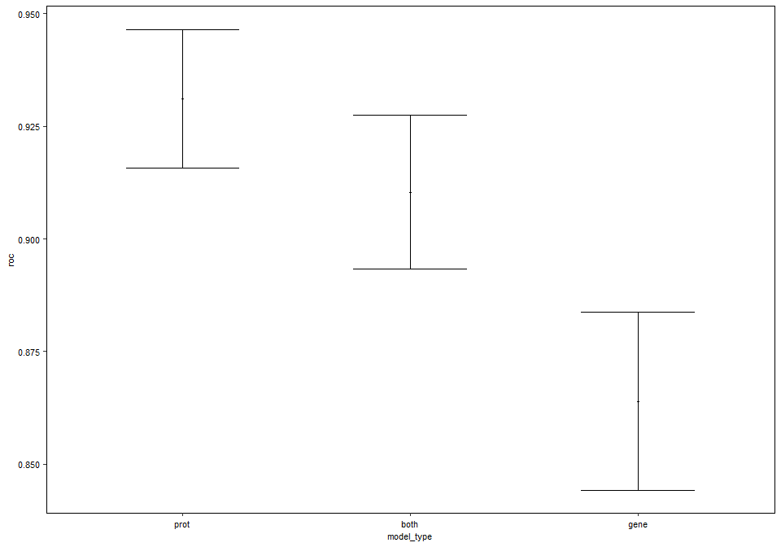
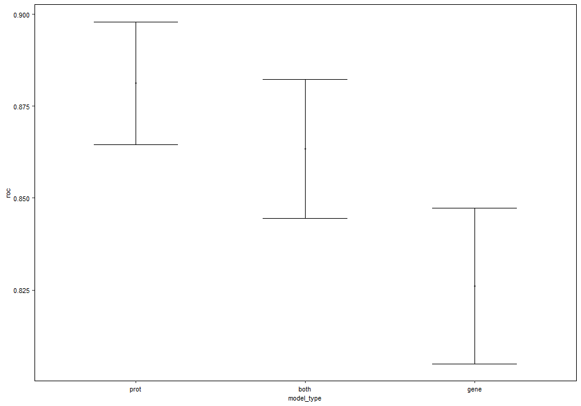

Supervised Learning
================
Jack Gisby
2022-04-28

-   [Load data and code](#load-data-and-code)
    -   [Load packages and custom
        functions](#load-packages-and-custom-functions)
    -   [Load normalised datasets](#load-normalised-datasets)
-   [Train models for COVID-19
    severity](#train-models-for-covid-19-severity)
    -   [Model generation](#model-generation)
    -   [Summarise performance](#summarise-performance)
-   [Session info](#session-info)

# Load data and code

## Load packages and custom functions

This chunk loads packages required for the notebook in addition to
custom functions in the `../R` directory. These include functions for
loading data, running differential expression and enrichment analyses
and making plots. The main functions and their arguments are described
by comments within these files.

``` r
# load relevant packages
library(SummarizedExperiment)
library(data.table)
library(edgeR)
library(DESeq2)
library(caret)
library(biomaRt)
library(rmcorr)

# set up plotting settings
library(ggplot2)
library(ggpubr)

theme_set(theme_pubr(border = TRUE))
theme_update(text = element_text(size = 8))

# load custom functions from the R/ directory
source("../R/preprocessing.R")
source("../R/de.R")

set.seed(1)
```

## Load normalised datasets

For the supervised learning analysis, we loaded and normalised the
transcriptomic and proteomic datasets as we have done in the previous
notebooks (`1_differential_expression.Rmd`, `2_gsva_analysis.Rmd`).
However, we additionally did the following prior to analysis: - Removed
samples that did not have both RNA-seq and protein data available -
Selected one sample for each individual, such that we picked the
earliest timepoint at which they had reached their peak COVID-19
severity - For the RNA-seq data, we normalised both waves simultaneously
rather than separately. - Removed duplicate aptamers that measured the
same protein target. - Removed genes with low variance (33% of genes
with the lowest variance).

The normalised data were saved in this repository
(`results/3_supervised_learning/collated_data`) and are loaded in the
chunk below.

``` r
# get normalised data for: i) proteomics; ii) RNA-seq; iii) both modalities. 
input_data <- list(
    "prot" = read.csv("../results/3_supervised_learning/collated_data/prot_input_data.csv"),
    "rna" = read.csv("../results/3_supervised_learning/collated_data/rna_input_data.csv"),
    "both" = read.csv("../results/3_supervised_learning/collated_data/both_input_data.csv")
)
```

# Train models for COVID-19 severity

## Model generation

In this chunk, we generate models for each data modality (genes,
proteins and both genes and proteins). Models are generated for 200
resamples using an 80:20 split; caret is used to fit random forests and
lasso models.

As part of this training, caret centers and scales the data, fits the
models and calculates area under the receiver operating characteristic
curve (AUC-ROC) for each resample. The AUC evaluates the model’s ability
to discriminate between severe/critical and mild/moderate disease.

``` r
# number of cross-validation iterations
num_resamples <- 200

# for each data modality
for (model_type in c("prot", "rna", "both")) {
    
    print(paste0("------------------------- ", model_type))
    
    # model tuning parameters
    tuneGrid <- list(
        "rf" = data.frame(mtry = floor(sqrt(ncol(input_data[[model_type]]) - 1))), 
        "glmnet" = data.frame(alpha = 1, lambda = seq(0, 1, length = 1000))
    )
    
    # create cross-validation data partitions
    set.seed(1)
    resamples <- createDataPartition(input_data[[model_type]]$.outcome, p = 0.8, times = num_resamples)
    
    trained_model <- list()
    
    # for each of: i) random forests; ii) lasso.
    for (algo in c("rf", "glmnet")) {
        
        print(paste0("---------- ", algo))
        
        set.seed(1)
        
        # train the models using caret
        trained_model[[algo]] <- train(
            x = dplyr::select(input_data[[model_type]], -.outcome), 
            y = input_data[[model_type]]$.outcome, 
            localImp = TRUE,
            method = algo, 
            metric = "ROC",
            proximity = TRUE,
            preProcess = c("center", "scale"),
            na.action = na.pass,
            tuneGrid = tuneGrid[[algo]],
            trControl = trainControl(
                method = "LGOCV", 
                classProbs = TRUE, 
                allowParallel = TRUE, 
                summaryFunction = twoClassSummary, 
                savePredictions = TRUE,
                index = resamples,
                verboseIter = TRUE
            )
        )
        
        # save the model
        saveRDS(trained_model[[algo]], paste0("../results/3_supervised_learning/", model_type, "_", algo, "_model.rds"))
    }
}
```

    ## [1] "------------------------- prot"
    ## [1] "---------- rf"
    ## + Resample001: mtry=79 
    ## - Resample001: mtry=79 
    ## + Resample002: mtry=79 
    ## - Resample002: mtry=79 
    ## + Resample003: mtry=79 
    ## - Resample003: mtry=79 
    ## + Resample004: mtry=79 
    ## - Resample004: mtry=79 
    ## + Resample005: mtry=79 
    ## - Resample005: mtry=79 
    ## + Resample006: mtry=79 
    ## - Resample006: mtry=79 
    ## + Resample007: mtry=79 
    ## - Resample007: mtry=79 
    ## + Resample008: mtry=79 
    ## - Resample008: mtry=79 
    ## + Resample009: mtry=79 
    ## - Resample009: mtry=79 
    ## + Resample010: mtry=79 
    ## - Resample010: mtry=79 
    ## + Resample011: mtry=79 
    ## - Resample011: mtry=79 
    ## + Resample012: mtry=79 
    ## - Resample012: mtry=79 
    ## + Resample013: mtry=79 
    ## - Resample013: mtry=79 
    ## + Resample014: mtry=79 
    ## - Resample014: mtry=79 
    ## + Resample015: mtry=79 
    ## - Resample015: mtry=79 
    ## + Resample016: mtry=79 
    ## - Resample016: mtry=79 
    ## + Resample017: mtry=79 
    ## - Resample017: mtry=79 
    ## + Resample018: mtry=79 
    ## - Resample018: mtry=79 
    ## + Resample019: mtry=79 
    ## - Resample019: mtry=79 
    ## + Resample020: mtry=79 
    ## - Resample020: mtry=79 
    ## + Resample021: mtry=79 
    ## - Resample021: mtry=79 
    ## + Resample022: mtry=79 
    ## - Resample022: mtry=79 
    ## + Resample023: mtry=79 
    ## - Resample023: mtry=79 
    ## + Resample024: mtry=79 
    ## - Resample024: mtry=79 
    ## + Resample025: mtry=79 
    ## - Resample025: mtry=79 
    ## + Resample026: mtry=79 
    ## - Resample026: mtry=79 
    ## + Resample027: mtry=79 
    ## - Resample027: mtry=79 
    ## + Resample028: mtry=79 
    ## - Resample028: mtry=79 
    ## + Resample029: mtry=79 
    ## - Resample029: mtry=79 
    ## + Resample030: mtry=79 
    ## - Resample030: mtry=79 
    ## + Resample031: mtry=79 
    ## - Resample031: mtry=79 
    ## + Resample032: mtry=79 
    ## - Resample032: mtry=79 
    ## + Resample033: mtry=79 
    ## - Resample033: mtry=79 
    ## + Resample034: mtry=79 
    ## - Resample034: mtry=79 
    ## + Resample035: mtry=79 
    ## - Resample035: mtry=79 
    ## + Resample036: mtry=79 
    ## - Resample036: mtry=79 
    ## + Resample037: mtry=79 
    ## - Resample037: mtry=79 
    ## + Resample038: mtry=79 
    ## - Resample038: mtry=79 
    ## + Resample039: mtry=79 
    ## - Resample039: mtry=79 
    ## + Resample040: mtry=79 
    ## - Resample040: mtry=79 
    ## + Resample041: mtry=79 
    ## - Resample041: mtry=79 
    ## + Resample042: mtry=79 
    ## - Resample042: mtry=79 
    ## + Resample043: mtry=79 
    ## - Resample043: mtry=79 
    ## + Resample044: mtry=79 
    ## - Resample044: mtry=79 
    ## + Resample045: mtry=79 
    ## - Resample045: mtry=79 
    ## + Resample046: mtry=79 
    ## - Resample046: mtry=79 
    ## + Resample047: mtry=79 
    ## - Resample047: mtry=79 
    ## + Resample048: mtry=79 
    ## - Resample048: mtry=79 
    ## + Resample049: mtry=79 
    ## - Resample049: mtry=79 
    ## + Resample050: mtry=79 
    ## - Resample050: mtry=79 
    ## + Resample051: mtry=79 
    ## - Resample051: mtry=79 
    ## + Resample052: mtry=79 
    ## - Resample052: mtry=79 
    ## + Resample053: mtry=79 
    ## - Resample053: mtry=79 
    ## + Resample054: mtry=79 
    ## - Resample054: mtry=79 
    ## + Resample055: mtry=79 
    ## - Resample055: mtry=79 
    ## + Resample056: mtry=79 
    ## - Resample056: mtry=79 
    ## + Resample057: mtry=79 
    ## - Resample057: mtry=79 
    ## + Resample058: mtry=79 
    ## - Resample058: mtry=79 
    ## + Resample059: mtry=79 
    ## - Resample059: mtry=79 
    ## + Resample060: mtry=79 
    ## - Resample060: mtry=79 
    ## + Resample061: mtry=79 
    ## - Resample061: mtry=79 
    ## + Resample062: mtry=79 
    ## - Resample062: mtry=79 
    ## + Resample063: mtry=79 
    ## - Resample063: mtry=79 
    ## + Resample064: mtry=79 
    ## - Resample064: mtry=79 
    ## + Resample065: mtry=79 
    ## - Resample065: mtry=79 
    ## + Resample066: mtry=79 
    ## - Resample066: mtry=79 
    ## + Resample067: mtry=79 
    ## - Resample067: mtry=79 
    ## + Resample068: mtry=79 
    ## - Resample068: mtry=79 
    ## + Resample069: mtry=79 
    ## - Resample069: mtry=79 
    ## + Resample070: mtry=79 
    ## - Resample070: mtry=79 
    ## + Resample071: mtry=79 
    ## - Resample071: mtry=79 
    ## + Resample072: mtry=79 
    ## - Resample072: mtry=79 
    ## + Resample073: mtry=79 
    ## - Resample073: mtry=79 
    ## + Resample074: mtry=79 
    ## - Resample074: mtry=79 
    ## + Resample075: mtry=79 
    ## - Resample075: mtry=79 
    ## + Resample076: mtry=79 
    ## - Resample076: mtry=79 
    ## + Resample077: mtry=79 
    ## - Resample077: mtry=79 
    ## + Resample078: mtry=79 
    ## - Resample078: mtry=79 
    ## + Resample079: mtry=79 
    ## - Resample079: mtry=79 
    ## + Resample080: mtry=79 
    ## - Resample080: mtry=79 
    ## + Resample081: mtry=79 
    ## - Resample081: mtry=79 
    ## + Resample082: mtry=79 
    ## - Resample082: mtry=79 
    ## + Resample083: mtry=79 
    ## - Resample083: mtry=79 
    ## + Resample084: mtry=79 
    ## - Resample084: mtry=79 
    ## + Resample085: mtry=79 
    ## - Resample085: mtry=79 
    ## + Resample086: mtry=79 
    ## - Resample086: mtry=79 
    ## + Resample087: mtry=79 
    ## - Resample087: mtry=79 
    ## + Resample088: mtry=79 
    ## - Resample088: mtry=79 
    ## + Resample089: mtry=79 
    ## - Resample089: mtry=79 
    ## + Resample090: mtry=79 
    ## - Resample090: mtry=79 
    ## + Resample091: mtry=79 
    ## - Resample091: mtry=79 
    ## + Resample092: mtry=79 
    ## - Resample092: mtry=79 
    ## + Resample093: mtry=79 
    ## - Resample093: mtry=79 
    ## + Resample094: mtry=79 
    ## - Resample094: mtry=79 
    ## + Resample095: mtry=79 
    ## - Resample095: mtry=79 
    ## + Resample096: mtry=79 
    ## - Resample096: mtry=79 
    ## + Resample097: mtry=79 
    ## - Resample097: mtry=79 
    ## + Resample098: mtry=79 
    ## - Resample098: mtry=79 
    ## + Resample099: mtry=79 
    ## - Resample099: mtry=79 
    ## + Resample100: mtry=79 
    ## - Resample100: mtry=79 
    ## + Resample101: mtry=79 
    ## - Resample101: mtry=79 
    ## + Resample102: mtry=79 
    ## - Resample102: mtry=79 
    ## + Resample103: mtry=79 
    ## - Resample103: mtry=79 
    ## + Resample104: mtry=79 
    ## - Resample104: mtry=79 
    ## + Resample105: mtry=79 
    ## - Resample105: mtry=79 
    ## + Resample106: mtry=79 
    ## - Resample106: mtry=79 
    ## + Resample107: mtry=79 
    ## - Resample107: mtry=79 
    ## + Resample108: mtry=79 
    ## - Resample108: mtry=79 
    ## + Resample109: mtry=79 
    ## - Resample109: mtry=79 
    ## + Resample110: mtry=79 
    ## - Resample110: mtry=79 
    ## + Resample111: mtry=79 
    ## - Resample111: mtry=79 
    ## + Resample112: mtry=79 
    ## - Resample112: mtry=79 
    ## + Resample113: mtry=79 
    ## - Resample113: mtry=79 
    ## + Resample114: mtry=79 
    ## - Resample114: mtry=79 
    ## + Resample115: mtry=79 
    ## - Resample115: mtry=79 
    ## + Resample116: mtry=79 
    ## - Resample116: mtry=79 
    ## + Resample117: mtry=79 
    ## - Resample117: mtry=79 
    ## + Resample118: mtry=79 
    ## - Resample118: mtry=79 
    ## + Resample119: mtry=79 
    ## - Resample119: mtry=79 
    ## + Resample120: mtry=79 
    ## - Resample120: mtry=79 
    ## + Resample121: mtry=79 
    ## - Resample121: mtry=79 
    ## + Resample122: mtry=79 
    ## - Resample122: mtry=79 
    ## + Resample123: mtry=79 
    ## - Resample123: mtry=79 
    ## + Resample124: mtry=79 
    ## - Resample124: mtry=79 
    ## + Resample125: mtry=79 
    ## - Resample125: mtry=79 
    ## + Resample126: mtry=79 
    ## - Resample126: mtry=79 
    ## + Resample127: mtry=79 
    ## - Resample127: mtry=79 
    ## + Resample128: mtry=79 
    ## - Resample128: mtry=79 
    ## + Resample129: mtry=79 
    ## - Resample129: mtry=79 
    ## + Resample130: mtry=79 
    ## - Resample130: mtry=79 
    ## + Resample131: mtry=79 
    ## - Resample131: mtry=79 
    ## + Resample132: mtry=79 
    ## - Resample132: mtry=79 
    ## + Resample133: mtry=79 
    ## - Resample133: mtry=79 
    ## + Resample134: mtry=79 
    ## - Resample134: mtry=79 
    ## + Resample135: mtry=79 
    ## - Resample135: mtry=79 
    ## + Resample136: mtry=79 
    ## - Resample136: mtry=79 
    ## + Resample137: mtry=79 
    ## - Resample137: mtry=79 
    ## + Resample138: mtry=79 
    ## - Resample138: mtry=79 
    ## + Resample139: mtry=79 
    ## - Resample139: mtry=79 
    ## + Resample140: mtry=79 
    ## - Resample140: mtry=79 
    ## + Resample141: mtry=79 
    ## - Resample141: mtry=79 
    ## + Resample142: mtry=79 
    ## - Resample142: mtry=79 
    ## + Resample143: mtry=79 
    ## - Resample143: mtry=79 
    ## + Resample144: mtry=79 
    ## - Resample144: mtry=79 
    ## + Resample145: mtry=79 
    ## - Resample145: mtry=79 
    ## + Resample146: mtry=79 
    ## - Resample146: mtry=79 
    ## + Resample147: mtry=79 
    ## - Resample147: mtry=79 
    ## + Resample148: mtry=79 
    ## - Resample148: mtry=79 
    ## + Resample149: mtry=79 
    ## - Resample149: mtry=79 
    ## + Resample150: mtry=79 
    ## - Resample150: mtry=79 
    ## + Resample151: mtry=79 
    ## - Resample151: mtry=79 
    ## + Resample152: mtry=79 
    ## - Resample152: mtry=79 
    ## + Resample153: mtry=79 
    ## - Resample153: mtry=79 
    ## + Resample154: mtry=79 
    ## - Resample154: mtry=79 
    ## + Resample155: mtry=79 
    ## - Resample155: mtry=79 
    ## + Resample156: mtry=79 
    ## - Resample156: mtry=79 
    ## + Resample157: mtry=79 
    ## - Resample157: mtry=79 
    ## + Resample158: mtry=79 
    ## - Resample158: mtry=79 
    ## + Resample159: mtry=79 
    ## - Resample159: mtry=79 
    ## + Resample160: mtry=79 
    ## - Resample160: mtry=79 
    ## + Resample161: mtry=79 
    ## - Resample161: mtry=79 
    ## + Resample162: mtry=79 
    ## - Resample162: mtry=79 
    ## + Resample163: mtry=79 
    ## - Resample163: mtry=79 
    ## + Resample164: mtry=79 
    ## - Resample164: mtry=79 
    ## + Resample165: mtry=79 
    ## - Resample165: mtry=79 
    ## + Resample166: mtry=79 
    ## - Resample166: mtry=79 
    ## + Resample167: mtry=79 
    ## - Resample167: mtry=79 
    ## + Resample168: mtry=79 
    ## - Resample168: mtry=79 
    ## + Resample169: mtry=79 
    ## - Resample169: mtry=79 
    ## + Resample170: mtry=79 
    ## - Resample170: mtry=79 
    ## + Resample171: mtry=79 
    ## - Resample171: mtry=79 
    ## + Resample172: mtry=79 
    ## - Resample172: mtry=79 
    ## + Resample173: mtry=79 
    ## - Resample173: mtry=79 
    ## + Resample174: mtry=79 
    ## - Resample174: mtry=79 
    ## + Resample175: mtry=79 
    ## - Resample175: mtry=79 
    ## + Resample176: mtry=79 
    ## - Resample176: mtry=79 
    ## + Resample177: mtry=79 
    ## - Resample177: mtry=79 
    ## + Resample178: mtry=79 
    ## - Resample178: mtry=79 
    ## + Resample179: mtry=79 
    ## - Resample179: mtry=79 
    ## + Resample180: mtry=79 
    ## - Resample180: mtry=79 
    ## + Resample181: mtry=79 
    ## - Resample181: mtry=79 
    ## + Resample182: mtry=79 
    ## - Resample182: mtry=79 
    ## + Resample183: mtry=79 
    ## - Resample183: mtry=79 
    ## + Resample184: mtry=79 
    ## - Resample184: mtry=79 
    ## + Resample185: mtry=79 
    ## - Resample185: mtry=79 
    ## + Resample186: mtry=79 
    ## - Resample186: mtry=79 
    ## + Resample187: mtry=79 
    ## - Resample187: mtry=79 
    ## + Resample188: mtry=79 
    ## - Resample188: mtry=79 
    ## + Resample189: mtry=79 
    ## - Resample189: mtry=79 
    ## + Resample190: mtry=79 
    ## - Resample190: mtry=79 
    ## + Resample191: mtry=79 
    ## - Resample191: mtry=79 
    ## + Resample192: mtry=79 
    ## - Resample192: mtry=79 
    ## + Resample193: mtry=79 
    ## - Resample193: mtry=79 
    ## + Resample194: mtry=79 
    ## - Resample194: mtry=79 
    ## + Resample195: mtry=79 
    ## - Resample195: mtry=79 
    ## + Resample196: mtry=79 
    ## - Resample196: mtry=79 
    ## + Resample197: mtry=79 
    ## - Resample197: mtry=79 
    ## + Resample198: mtry=79 
    ## - Resample198: mtry=79 
    ## + Resample199: mtry=79 
    ## - Resample199: mtry=79 
    ## + Resample200: mtry=79 
    ## - Resample200: mtry=79 
    ## Aggregating results
    ## Fitting final model on full training set
    ## [1] "---------- glmnet"
    ## + Resample001: alpha=1, lambda=1 
    ## - Resample001: alpha=1, lambda=1 
    ## + Resample002: alpha=1, lambda=1 
    ## - Resample002: alpha=1, lambda=1 
    ## + Resample003: alpha=1, lambda=1 
    ## - Resample003: alpha=1, lambda=1 
    ## + Resample004: alpha=1, lambda=1 
    ## - Resample004: alpha=1, lambda=1 
    ## + Resample005: alpha=1, lambda=1 
    ## - Resample005: alpha=1, lambda=1 
    ## + Resample006: alpha=1, lambda=1 
    ## - Resample006: alpha=1, lambda=1 
    ## + Resample007: alpha=1, lambda=1 
    ## - Resample007: alpha=1, lambda=1 
    ## + Resample008: alpha=1, lambda=1 
    ## - Resample008: alpha=1, lambda=1 
    ## + Resample009: alpha=1, lambda=1 
    ## - Resample009: alpha=1, lambda=1 
    ## + Resample010: alpha=1, lambda=1 
    ## - Resample010: alpha=1, lambda=1 
    ## + Resample011: alpha=1, lambda=1 
    ## - Resample011: alpha=1, lambda=1 
    ## + Resample012: alpha=1, lambda=1 
    ## - Resample012: alpha=1, lambda=1 
    ## + Resample013: alpha=1, lambda=1 
    ## - Resample013: alpha=1, lambda=1 
    ## + Resample014: alpha=1, lambda=1 
    ## - Resample014: alpha=1, lambda=1 
    ## + Resample015: alpha=1, lambda=1 
    ## - Resample015: alpha=1, lambda=1 
    ## + Resample016: alpha=1, lambda=1 
    ## - Resample016: alpha=1, lambda=1 
    ## + Resample017: alpha=1, lambda=1 
    ## - Resample017: alpha=1, lambda=1 
    ## + Resample018: alpha=1, lambda=1 
    ## - Resample018: alpha=1, lambda=1 
    ## + Resample019: alpha=1, lambda=1 
    ## - Resample019: alpha=1, lambda=1 
    ## + Resample020: alpha=1, lambda=1 
    ## - Resample020: alpha=1, lambda=1 
    ## + Resample021: alpha=1, lambda=1 
    ## - Resample021: alpha=1, lambda=1 
    ## + Resample022: alpha=1, lambda=1 
    ## - Resample022: alpha=1, lambda=1 
    ## + Resample023: alpha=1, lambda=1 
    ## - Resample023: alpha=1, lambda=1 
    ## + Resample024: alpha=1, lambda=1 
    ## - Resample024: alpha=1, lambda=1 
    ## + Resample025: alpha=1, lambda=1 
    ## - Resample025: alpha=1, lambda=1 
    ## + Resample026: alpha=1, lambda=1 
    ## - Resample026: alpha=1, lambda=1 
    ## + Resample027: alpha=1, lambda=1 
    ## - Resample027: alpha=1, lambda=1 
    ## + Resample028: alpha=1, lambda=1 
    ## - Resample028: alpha=1, lambda=1 
    ## + Resample029: alpha=1, lambda=1 
    ## - Resample029: alpha=1, lambda=1 
    ## + Resample030: alpha=1, lambda=1 
    ## - Resample030: alpha=1, lambda=1 
    ## + Resample031: alpha=1, lambda=1 
    ## - Resample031: alpha=1, lambda=1 
    ## + Resample032: alpha=1, lambda=1 
    ## - Resample032: alpha=1, lambda=1 
    ## + Resample033: alpha=1, lambda=1 
    ## - Resample033: alpha=1, lambda=1 
    ## + Resample034: alpha=1, lambda=1 
    ## - Resample034: alpha=1, lambda=1 
    ## + Resample035: alpha=1, lambda=1 
    ## - Resample035: alpha=1, lambda=1 
    ## + Resample036: alpha=1, lambda=1 
    ## - Resample036: alpha=1, lambda=1 
    ## + Resample037: alpha=1, lambda=1 
    ## - Resample037: alpha=1, lambda=1 
    ## + Resample038: alpha=1, lambda=1 
    ## - Resample038: alpha=1, lambda=1 
    ## + Resample039: alpha=1, lambda=1 
    ## - Resample039: alpha=1, lambda=1 
    ## + Resample040: alpha=1, lambda=1 
    ## - Resample040: alpha=1, lambda=1 
    ## + Resample041: alpha=1, lambda=1 
    ## - Resample041: alpha=1, lambda=1 
    ## + Resample042: alpha=1, lambda=1 
    ## - Resample042: alpha=1, lambda=1 
    ## + Resample043: alpha=1, lambda=1 
    ## - Resample043: alpha=1, lambda=1 
    ## + Resample044: alpha=1, lambda=1 
    ## - Resample044: alpha=1, lambda=1 
    ## + Resample045: alpha=1, lambda=1 
    ## - Resample045: alpha=1, lambda=1 
    ## + Resample046: alpha=1, lambda=1 
    ## - Resample046: alpha=1, lambda=1 
    ## + Resample047: alpha=1, lambda=1 
    ## - Resample047: alpha=1, lambda=1 
    ## + Resample048: alpha=1, lambda=1 
    ## - Resample048: alpha=1, lambda=1 
    ## + Resample049: alpha=1, lambda=1 
    ## - Resample049: alpha=1, lambda=1 
    ## + Resample050: alpha=1, lambda=1 
    ## - Resample050: alpha=1, lambda=1 
    ## + Resample051: alpha=1, lambda=1 
    ## - Resample051: alpha=1, lambda=1 
    ## + Resample052: alpha=1, lambda=1 
    ## - Resample052: alpha=1, lambda=1 
    ## + Resample053: alpha=1, lambda=1 
    ## - Resample053: alpha=1, lambda=1 
    ## + Resample054: alpha=1, lambda=1 
    ## - Resample054: alpha=1, lambda=1 
    ## + Resample055: alpha=1, lambda=1 
    ## - Resample055: alpha=1, lambda=1 
    ## + Resample056: alpha=1, lambda=1 
    ## - Resample056: alpha=1, lambda=1 
    ## + Resample057: alpha=1, lambda=1 
    ## - Resample057: alpha=1, lambda=1 
    ## + Resample058: alpha=1, lambda=1 
    ## - Resample058: alpha=1, lambda=1 
    ## + Resample059: alpha=1, lambda=1 
    ## - Resample059: alpha=1, lambda=1 
    ## + Resample060: alpha=1, lambda=1 
    ## - Resample060: alpha=1, lambda=1 
    ## + Resample061: alpha=1, lambda=1 
    ## - Resample061: alpha=1, lambda=1 
    ## + Resample062: alpha=1, lambda=1 
    ## - Resample062: alpha=1, lambda=1 
    ## + Resample063: alpha=1, lambda=1 
    ## - Resample063: alpha=1, lambda=1 
    ## + Resample064: alpha=1, lambda=1 
    ## - Resample064: alpha=1, lambda=1 
    ## + Resample065: alpha=1, lambda=1 
    ## - Resample065: alpha=1, lambda=1 
    ## + Resample066: alpha=1, lambda=1 
    ## - Resample066: alpha=1, lambda=1 
    ## + Resample067: alpha=1, lambda=1 
    ## - Resample067: alpha=1, lambda=1 
    ## + Resample068: alpha=1, lambda=1 
    ## - Resample068: alpha=1, lambda=1 
    ## + Resample069: alpha=1, lambda=1 
    ## - Resample069: alpha=1, lambda=1 
    ## + Resample070: alpha=1, lambda=1 
    ## - Resample070: alpha=1, lambda=1 
    ## + Resample071: alpha=1, lambda=1 
    ## - Resample071: alpha=1, lambda=1 
    ## + Resample072: alpha=1, lambda=1 
    ## - Resample072: alpha=1, lambda=1 
    ## + Resample073: alpha=1, lambda=1 
    ## - Resample073: alpha=1, lambda=1 
    ## + Resample074: alpha=1, lambda=1 
    ## - Resample074: alpha=1, lambda=1 
    ## + Resample075: alpha=1, lambda=1 
    ## - Resample075: alpha=1, lambda=1 
    ## + Resample076: alpha=1, lambda=1 
    ## - Resample076: alpha=1, lambda=1 
    ## + Resample077: alpha=1, lambda=1 
    ## - Resample077: alpha=1, lambda=1 
    ## + Resample078: alpha=1, lambda=1 
    ## - Resample078: alpha=1, lambda=1 
    ## + Resample079: alpha=1, lambda=1 
    ## - Resample079: alpha=1, lambda=1 
    ## + Resample080: alpha=1, lambda=1 
    ## - Resample080: alpha=1, lambda=1 
    ## + Resample081: alpha=1, lambda=1 
    ## - Resample081: alpha=1, lambda=1 
    ## + Resample082: alpha=1, lambda=1 
    ## - Resample082: alpha=1, lambda=1 
    ## + Resample083: alpha=1, lambda=1 
    ## - Resample083: alpha=1, lambda=1 
    ## + Resample084: alpha=1, lambda=1 
    ## - Resample084: alpha=1, lambda=1 
    ## + Resample085: alpha=1, lambda=1 
    ## - Resample085: alpha=1, lambda=1 
    ## + Resample086: alpha=1, lambda=1 
    ## - Resample086: alpha=1, lambda=1 
    ## + Resample087: alpha=1, lambda=1 
    ## - Resample087: alpha=1, lambda=1 
    ## + Resample088: alpha=1, lambda=1 
    ## - Resample088: alpha=1, lambda=1 
    ## + Resample089: alpha=1, lambda=1 
    ## - Resample089: alpha=1, lambda=1 
    ## + Resample090: alpha=1, lambda=1 
    ## - Resample090: alpha=1, lambda=1 
    ## + Resample091: alpha=1, lambda=1 
    ## - Resample091: alpha=1, lambda=1 
    ## + Resample092: alpha=1, lambda=1 
    ## - Resample092: alpha=1, lambda=1 
    ## + Resample093: alpha=1, lambda=1 
    ## - Resample093: alpha=1, lambda=1 
    ## + Resample094: alpha=1, lambda=1 
    ## - Resample094: alpha=1, lambda=1 
    ## + Resample095: alpha=1, lambda=1 
    ## - Resample095: alpha=1, lambda=1 
    ## + Resample096: alpha=1, lambda=1 
    ## - Resample096: alpha=1, lambda=1 
    ## + Resample097: alpha=1, lambda=1 
    ## - Resample097: alpha=1, lambda=1 
    ## + Resample098: alpha=1, lambda=1 
    ## - Resample098: alpha=1, lambda=1 
    ## + Resample099: alpha=1, lambda=1 
    ## - Resample099: alpha=1, lambda=1 
    ## + Resample100: alpha=1, lambda=1 
    ## - Resample100: alpha=1, lambda=1 
    ## + Resample101: alpha=1, lambda=1 
    ## - Resample101: alpha=1, lambda=1 
    ## + Resample102: alpha=1, lambda=1 
    ## - Resample102: alpha=1, lambda=1 
    ## + Resample103: alpha=1, lambda=1 
    ## - Resample103: alpha=1, lambda=1 
    ## + Resample104: alpha=1, lambda=1 
    ## - Resample104: alpha=1, lambda=1 
    ## + Resample105: alpha=1, lambda=1 
    ## - Resample105: alpha=1, lambda=1 
    ## + Resample106: alpha=1, lambda=1 
    ## - Resample106: alpha=1, lambda=1 
    ## + Resample107: alpha=1, lambda=1 
    ## - Resample107: alpha=1, lambda=1 
    ## + Resample108: alpha=1, lambda=1 
    ## - Resample108: alpha=1, lambda=1 
    ## + Resample109: alpha=1, lambda=1 
    ## - Resample109: alpha=1, lambda=1 
    ## + Resample110: alpha=1, lambda=1 
    ## - Resample110: alpha=1, lambda=1 
    ## + Resample111: alpha=1, lambda=1 
    ## - Resample111: alpha=1, lambda=1 
    ## + Resample112: alpha=1, lambda=1 
    ## - Resample112: alpha=1, lambda=1 
    ## + Resample113: alpha=1, lambda=1 
    ## - Resample113: alpha=1, lambda=1 
    ## + Resample114: alpha=1, lambda=1 
    ## - Resample114: alpha=1, lambda=1 
    ## + Resample115: alpha=1, lambda=1 
    ## - Resample115: alpha=1, lambda=1 
    ## + Resample116: alpha=1, lambda=1 
    ## - Resample116: alpha=1, lambda=1 
    ## + Resample117: alpha=1, lambda=1 
    ## - Resample117: alpha=1, lambda=1 
    ## + Resample118: alpha=1, lambda=1 
    ## - Resample118: alpha=1, lambda=1 
    ## + Resample119: alpha=1, lambda=1 
    ## - Resample119: alpha=1, lambda=1 
    ## + Resample120: alpha=1, lambda=1 
    ## - Resample120: alpha=1, lambda=1 
    ## + Resample121: alpha=1, lambda=1 
    ## - Resample121: alpha=1, lambda=1 
    ## + Resample122: alpha=1, lambda=1 
    ## - Resample122: alpha=1, lambda=1 
    ## + Resample123: alpha=1, lambda=1 
    ## - Resample123: alpha=1, lambda=1 
    ## + Resample124: alpha=1, lambda=1 
    ## - Resample124: alpha=1, lambda=1 
    ## + Resample125: alpha=1, lambda=1 
    ## - Resample125: alpha=1, lambda=1 
    ## + Resample126: alpha=1, lambda=1 
    ## - Resample126: alpha=1, lambda=1 
    ## + Resample127: alpha=1, lambda=1 
    ## - Resample127: alpha=1, lambda=1 
    ## + Resample128: alpha=1, lambda=1 
    ## - Resample128: alpha=1, lambda=1 
    ## + Resample129: alpha=1, lambda=1 
    ## - Resample129: alpha=1, lambda=1 
    ## + Resample130: alpha=1, lambda=1 
    ## - Resample130: alpha=1, lambda=1 
    ## + Resample131: alpha=1, lambda=1 
    ## - Resample131: alpha=1, lambda=1 
    ## + Resample132: alpha=1, lambda=1 
    ## - Resample132: alpha=1, lambda=1 
    ## + Resample133: alpha=1, lambda=1 
    ## - Resample133: alpha=1, lambda=1 
    ## + Resample134: alpha=1, lambda=1 
    ## - Resample134: alpha=1, lambda=1 
    ## + Resample135: alpha=1, lambda=1 
    ## - Resample135: alpha=1, lambda=1 
    ## + Resample136: alpha=1, lambda=1 
    ## - Resample136: alpha=1, lambda=1 
    ## + Resample137: alpha=1, lambda=1 
    ## - Resample137: alpha=1, lambda=1 
    ## + Resample138: alpha=1, lambda=1 
    ## - Resample138: alpha=1, lambda=1 
    ## + Resample139: alpha=1, lambda=1 
    ## - Resample139: alpha=1, lambda=1 
    ## + Resample140: alpha=1, lambda=1 
    ## - Resample140: alpha=1, lambda=1 
    ## + Resample141: alpha=1, lambda=1 
    ## - Resample141: alpha=1, lambda=1 
    ## + Resample142: alpha=1, lambda=1 
    ## - Resample142: alpha=1, lambda=1 
    ## + Resample143: alpha=1, lambda=1 
    ## - Resample143: alpha=1, lambda=1 
    ## + Resample144: alpha=1, lambda=1 
    ## - Resample144: alpha=1, lambda=1 
    ## + Resample145: alpha=1, lambda=1 
    ## - Resample145: alpha=1, lambda=1 
    ## + Resample146: alpha=1, lambda=1 
    ## - Resample146: alpha=1, lambda=1 
    ## + Resample147: alpha=1, lambda=1 
    ## - Resample147: alpha=1, lambda=1 
    ## + Resample148: alpha=1, lambda=1 
    ## - Resample148: alpha=1, lambda=1 
    ## + Resample149: alpha=1, lambda=1 
    ## - Resample149: alpha=1, lambda=1 
    ## + Resample150: alpha=1, lambda=1 
    ## - Resample150: alpha=1, lambda=1 
    ## + Resample151: alpha=1, lambda=1 
    ## - Resample151: alpha=1, lambda=1 
    ## + Resample152: alpha=1, lambda=1 
    ## - Resample152: alpha=1, lambda=1 
    ## + Resample153: alpha=1, lambda=1 
    ## - Resample153: alpha=1, lambda=1 
    ## + Resample154: alpha=1, lambda=1 
    ## - Resample154: alpha=1, lambda=1 
    ## + Resample155: alpha=1, lambda=1 
    ## - Resample155: alpha=1, lambda=1 
    ## + Resample156: alpha=1, lambda=1 
    ## - Resample156: alpha=1, lambda=1 
    ## + Resample157: alpha=1, lambda=1 
    ## - Resample157: alpha=1, lambda=1 
    ## + Resample158: alpha=1, lambda=1 
    ## - Resample158: alpha=1, lambda=1 
    ## + Resample159: alpha=1, lambda=1 
    ## - Resample159: alpha=1, lambda=1 
    ## + Resample160: alpha=1, lambda=1 
    ## - Resample160: alpha=1, lambda=1 
    ## + Resample161: alpha=1, lambda=1 
    ## - Resample161: alpha=1, lambda=1 
    ## + Resample162: alpha=1, lambda=1 
    ## - Resample162: alpha=1, lambda=1 
    ## + Resample163: alpha=1, lambda=1 
    ## - Resample163: alpha=1, lambda=1 
    ## + Resample164: alpha=1, lambda=1 
    ## - Resample164: alpha=1, lambda=1 
    ## + Resample165: alpha=1, lambda=1 
    ## - Resample165: alpha=1, lambda=1 
    ## + Resample166: alpha=1, lambda=1 
    ## - Resample166: alpha=1, lambda=1 
    ## + Resample167: alpha=1, lambda=1 
    ## - Resample167: alpha=1, lambda=1 
    ## + Resample168: alpha=1, lambda=1 
    ## - Resample168: alpha=1, lambda=1 
    ## + Resample169: alpha=1, lambda=1 
    ## - Resample169: alpha=1, lambda=1 
    ## + Resample170: alpha=1, lambda=1 
    ## - Resample170: alpha=1, lambda=1 
    ## + Resample171: alpha=1, lambda=1 
    ## - Resample171: alpha=1, lambda=1 
    ## + Resample172: alpha=1, lambda=1 
    ## - Resample172: alpha=1, lambda=1 
    ## + Resample173: alpha=1, lambda=1 
    ## - Resample173: alpha=1, lambda=1 
    ## + Resample174: alpha=1, lambda=1 
    ## - Resample174: alpha=1, lambda=1 
    ## + Resample175: alpha=1, lambda=1 
    ## - Resample175: alpha=1, lambda=1 
    ## + Resample176: alpha=1, lambda=1 
    ## - Resample176: alpha=1, lambda=1 
    ## + Resample177: alpha=1, lambda=1 
    ## - Resample177: alpha=1, lambda=1 
    ## + Resample178: alpha=1, lambda=1 
    ## - Resample178: alpha=1, lambda=1 
    ## + Resample179: alpha=1, lambda=1 
    ## - Resample179: alpha=1, lambda=1 
    ## + Resample180: alpha=1, lambda=1 
    ## - Resample180: alpha=1, lambda=1 
    ## + Resample181: alpha=1, lambda=1 
    ## - Resample181: alpha=1, lambda=1 
    ## + Resample182: alpha=1, lambda=1 
    ## - Resample182: alpha=1, lambda=1 
    ## + Resample183: alpha=1, lambda=1 
    ## - Resample183: alpha=1, lambda=1 
    ## + Resample184: alpha=1, lambda=1 
    ## - Resample184: alpha=1, lambda=1 
    ## + Resample185: alpha=1, lambda=1 
    ## - Resample185: alpha=1, lambda=1 
    ## + Resample186: alpha=1, lambda=1 
    ## - Resample186: alpha=1, lambda=1 
    ## + Resample187: alpha=1, lambda=1 
    ## - Resample187: alpha=1, lambda=1 
    ## + Resample188: alpha=1, lambda=1 
    ## - Resample188: alpha=1, lambda=1 
    ## + Resample189: alpha=1, lambda=1 
    ## - Resample189: alpha=1, lambda=1 
    ## + Resample190: alpha=1, lambda=1 
    ## - Resample190: alpha=1, lambda=1 
    ## + Resample191: alpha=1, lambda=1 
    ## - Resample191: alpha=1, lambda=1 
    ## + Resample192: alpha=1, lambda=1 
    ## - Resample192: alpha=1, lambda=1 
    ## + Resample193: alpha=1, lambda=1 
    ## - Resample193: alpha=1, lambda=1 
    ## + Resample194: alpha=1, lambda=1 
    ## - Resample194: alpha=1, lambda=1 
    ## + Resample195: alpha=1, lambda=1 
    ## - Resample195: alpha=1, lambda=1 
    ## + Resample196: alpha=1, lambda=1 
    ## - Resample196: alpha=1, lambda=1 
    ## + Resample197: alpha=1, lambda=1 
    ## - Resample197: alpha=1, lambda=1 
    ## + Resample198: alpha=1, lambda=1 
    ## - Resample198: alpha=1, lambda=1 
    ## + Resample199: alpha=1, lambda=1 
    ## - Resample199: alpha=1, lambda=1 
    ## + Resample200: alpha=1, lambda=1 
    ## - Resample200: alpha=1, lambda=1 
    ## Aggregating results
    ## Selecting tuning parameters
    ## Fitting alpha = 1, lambda = 0.0691 on full training set
    ## [1] "------------------------- rna"
    ## [1] "---------- rf"
    ## + Resample001: mtry=110 
    ## - Resample001: mtry=110 
    ## + Resample002: mtry=110 
    ## - Resample002: mtry=110 
    ## + Resample003: mtry=110 
    ## - Resample003: mtry=110 
    ## + Resample004: mtry=110 
    ## - Resample004: mtry=110 
    ## + Resample005: mtry=110 
    ## - Resample005: mtry=110 
    ## + Resample006: mtry=110 
    ## - Resample006: mtry=110 
    ## + Resample007: mtry=110 
    ## - Resample007: mtry=110 
    ## + Resample008: mtry=110 
    ## - Resample008: mtry=110 
    ## + Resample009: mtry=110 
    ## - Resample009: mtry=110 
    ## + Resample010: mtry=110 
    ## - Resample010: mtry=110 
    ## + Resample011: mtry=110 
    ## - Resample011: mtry=110 
    ## + Resample012: mtry=110 
    ## - Resample012: mtry=110 
    ## + Resample013: mtry=110 
    ## - Resample013: mtry=110 
    ## + Resample014: mtry=110 
    ## - Resample014: mtry=110 
    ## + Resample015: mtry=110 
    ## - Resample015: mtry=110 
    ## + Resample016: mtry=110 
    ## - Resample016: mtry=110 
    ## + Resample017: mtry=110 
    ## - Resample017: mtry=110 
    ## + Resample018: mtry=110 
    ## - Resample018: mtry=110 
    ## + Resample019: mtry=110 
    ## - Resample019: mtry=110 
    ## + Resample020: mtry=110 
    ## - Resample020: mtry=110 
    ## + Resample021: mtry=110 
    ## - Resample021: mtry=110 
    ## + Resample022: mtry=110 
    ## - Resample022: mtry=110 
    ## + Resample023: mtry=110 
    ## - Resample023: mtry=110 
    ## + Resample024: mtry=110 
    ## - Resample024: mtry=110 
    ## + Resample025: mtry=110 
    ## - Resample025: mtry=110 
    ## + Resample026: mtry=110 
    ## - Resample026: mtry=110 
    ## + Resample027: mtry=110 
    ## - Resample027: mtry=110 
    ## + Resample028: mtry=110 
    ## - Resample028: mtry=110 
    ## + Resample029: mtry=110 
    ## - Resample029: mtry=110 
    ## + Resample030: mtry=110 
    ## - Resample030: mtry=110 
    ## + Resample031: mtry=110 
    ## - Resample031: mtry=110 
    ## + Resample032: mtry=110 
    ## - Resample032: mtry=110 
    ## + Resample033: mtry=110 
    ## - Resample033: mtry=110 
    ## + Resample034: mtry=110 
    ## - Resample034: mtry=110 
    ## + Resample035: mtry=110 
    ## - Resample035: mtry=110 
    ## + Resample036: mtry=110 
    ## - Resample036: mtry=110 
    ## + Resample037: mtry=110 
    ## - Resample037: mtry=110 
    ## + Resample038: mtry=110 
    ## - Resample038: mtry=110 
    ## + Resample039: mtry=110 
    ## - Resample039: mtry=110 
    ## + Resample040: mtry=110 
    ## - Resample040: mtry=110 
    ## + Resample041: mtry=110 
    ## - Resample041: mtry=110 
    ## + Resample042: mtry=110 
    ## - Resample042: mtry=110 
    ## + Resample043: mtry=110 
    ## - Resample043: mtry=110 
    ## + Resample044: mtry=110 
    ## - Resample044: mtry=110 
    ## + Resample045: mtry=110 
    ## - Resample045: mtry=110 
    ## + Resample046: mtry=110 
    ## - Resample046: mtry=110 
    ## + Resample047: mtry=110 
    ## - Resample047: mtry=110 
    ## + Resample048: mtry=110 
    ## - Resample048: mtry=110 
    ## + Resample049: mtry=110 
    ## - Resample049: mtry=110 
    ## + Resample050: mtry=110 
    ## - Resample050: mtry=110 
    ## + Resample051: mtry=110 
    ## - Resample051: mtry=110 
    ## + Resample052: mtry=110 
    ## - Resample052: mtry=110 
    ## + Resample053: mtry=110 
    ## - Resample053: mtry=110 
    ## + Resample054: mtry=110 
    ## - Resample054: mtry=110 
    ## + Resample055: mtry=110 
    ## - Resample055: mtry=110 
    ## + Resample056: mtry=110 
    ## - Resample056: mtry=110 
    ## + Resample057: mtry=110 
    ## - Resample057: mtry=110 
    ## + Resample058: mtry=110 
    ## - Resample058: mtry=110 
    ## + Resample059: mtry=110 
    ## - Resample059: mtry=110 
    ## + Resample060: mtry=110 
    ## - Resample060: mtry=110 
    ## + Resample061: mtry=110 
    ## - Resample061: mtry=110 
    ## + Resample062: mtry=110 
    ## - Resample062: mtry=110 
    ## + Resample063: mtry=110 
    ## - Resample063: mtry=110 
    ## + Resample064: mtry=110 
    ## - Resample064: mtry=110 
    ## + Resample065: mtry=110 
    ## - Resample065: mtry=110 
    ## + Resample066: mtry=110 
    ## - Resample066: mtry=110 
    ## + Resample067: mtry=110 
    ## - Resample067: mtry=110 
    ## + Resample068: mtry=110 
    ## - Resample068: mtry=110 
    ## + Resample069: mtry=110 
    ## - Resample069: mtry=110 
    ## + Resample070: mtry=110 
    ## - Resample070: mtry=110 
    ## + Resample071: mtry=110 
    ## - Resample071: mtry=110 
    ## + Resample072: mtry=110 
    ## - Resample072: mtry=110 
    ## + Resample073: mtry=110 
    ## - Resample073: mtry=110 
    ## + Resample074: mtry=110 
    ## - Resample074: mtry=110 
    ## + Resample075: mtry=110 
    ## - Resample075: mtry=110 
    ## + Resample076: mtry=110 
    ## - Resample076: mtry=110 
    ## + Resample077: mtry=110 
    ## - Resample077: mtry=110 
    ## + Resample078: mtry=110 
    ## - Resample078: mtry=110 
    ## + Resample079: mtry=110 
    ## - Resample079: mtry=110 
    ## + Resample080: mtry=110 
    ## - Resample080: mtry=110 
    ## + Resample081: mtry=110 
    ## - Resample081: mtry=110 
    ## + Resample082: mtry=110 
    ## - Resample082: mtry=110 
    ## + Resample083: mtry=110 
    ## - Resample083: mtry=110 
    ## + Resample084: mtry=110 
    ## - Resample084: mtry=110 
    ## + Resample085: mtry=110 
    ## - Resample085: mtry=110 
    ## + Resample086: mtry=110 
    ## - Resample086: mtry=110 
    ## + Resample087: mtry=110 
    ## - Resample087: mtry=110 
    ## + Resample088: mtry=110 
    ## - Resample088: mtry=110 
    ## + Resample089: mtry=110 
    ## - Resample089: mtry=110 
    ## + Resample090: mtry=110 
    ## - Resample090: mtry=110 
    ## + Resample091: mtry=110 
    ## - Resample091: mtry=110 
    ## + Resample092: mtry=110 
    ## - Resample092: mtry=110 
    ## + Resample093: mtry=110 
    ## - Resample093: mtry=110 
    ## + Resample094: mtry=110 
    ## - Resample094: mtry=110 
    ## + Resample095: mtry=110 
    ## - Resample095: mtry=110 
    ## + Resample096: mtry=110 
    ## - Resample096: mtry=110 
    ## + Resample097: mtry=110 
    ## - Resample097: mtry=110 
    ## + Resample098: mtry=110 
    ## - Resample098: mtry=110 
    ## + Resample099: mtry=110 
    ## - Resample099: mtry=110 
    ## + Resample100: mtry=110 
    ## - Resample100: mtry=110 
    ## + Resample101: mtry=110 
    ## - Resample101: mtry=110 
    ## + Resample102: mtry=110 
    ## - Resample102: mtry=110 
    ## + Resample103: mtry=110 
    ## - Resample103: mtry=110 
    ## + Resample104: mtry=110 
    ## - Resample104: mtry=110 
    ## + Resample105: mtry=110 
    ## - Resample105: mtry=110 
    ## + Resample106: mtry=110 
    ## - Resample106: mtry=110 
    ## + Resample107: mtry=110 
    ## - Resample107: mtry=110 
    ## + Resample108: mtry=110 
    ## - Resample108: mtry=110 
    ## + Resample109: mtry=110 
    ## - Resample109: mtry=110 
    ## + Resample110: mtry=110 
    ## - Resample110: mtry=110 
    ## + Resample111: mtry=110 
    ## - Resample111: mtry=110 
    ## + Resample112: mtry=110 
    ## - Resample112: mtry=110 
    ## + Resample113: mtry=110 
    ## - Resample113: mtry=110 
    ## + Resample114: mtry=110 
    ## - Resample114: mtry=110 
    ## + Resample115: mtry=110 
    ## - Resample115: mtry=110 
    ## + Resample116: mtry=110 
    ## - Resample116: mtry=110 
    ## + Resample117: mtry=110 
    ## - Resample117: mtry=110 
    ## + Resample118: mtry=110 
    ## - Resample118: mtry=110 
    ## + Resample119: mtry=110 
    ## - Resample119: mtry=110 
    ## + Resample120: mtry=110 
    ## - Resample120: mtry=110 
    ## + Resample121: mtry=110 
    ## - Resample121: mtry=110 
    ## + Resample122: mtry=110 
    ## - Resample122: mtry=110 
    ## + Resample123: mtry=110 
    ## - Resample123: mtry=110 
    ## + Resample124: mtry=110 
    ## - Resample124: mtry=110 
    ## + Resample125: mtry=110 
    ## - Resample125: mtry=110 
    ## + Resample126: mtry=110 
    ## - Resample126: mtry=110 
    ## + Resample127: mtry=110 
    ## - Resample127: mtry=110 
    ## + Resample128: mtry=110 
    ## - Resample128: mtry=110 
    ## + Resample129: mtry=110 
    ## - Resample129: mtry=110 
    ## + Resample130: mtry=110 
    ## - Resample130: mtry=110 
    ## + Resample131: mtry=110 
    ## - Resample131: mtry=110 
    ## + Resample132: mtry=110 
    ## - Resample132: mtry=110 
    ## + Resample133: mtry=110 
    ## - Resample133: mtry=110 
    ## + Resample134: mtry=110 
    ## - Resample134: mtry=110 
    ## + Resample135: mtry=110 
    ## - Resample135: mtry=110 
    ## + Resample136: mtry=110 
    ## - Resample136: mtry=110 
    ## + Resample137: mtry=110 
    ## - Resample137: mtry=110 
    ## + Resample138: mtry=110 
    ## - Resample138: mtry=110 
    ## + Resample139: mtry=110 
    ## - Resample139: mtry=110 
    ## + Resample140: mtry=110 
    ## - Resample140: mtry=110 
    ## + Resample141: mtry=110 
    ## - Resample141: mtry=110 
    ## + Resample142: mtry=110 
    ## - Resample142: mtry=110 
    ## + Resample143: mtry=110 
    ## - Resample143: mtry=110 
    ## + Resample144: mtry=110 
    ## - Resample144: mtry=110 
    ## + Resample145: mtry=110 
    ## - Resample145: mtry=110 
    ## + Resample146: mtry=110 
    ## - Resample146: mtry=110 
    ## + Resample147: mtry=110 
    ## - Resample147: mtry=110 
    ## + Resample148: mtry=110 
    ## - Resample148: mtry=110 
    ## + Resample149: mtry=110 
    ## - Resample149: mtry=110 
    ## + Resample150: mtry=110 
    ## - Resample150: mtry=110 
    ## + Resample151: mtry=110 
    ## - Resample151: mtry=110 
    ## + Resample152: mtry=110 
    ## - Resample152: mtry=110 
    ## + Resample153: mtry=110 
    ## - Resample153: mtry=110 
    ## + Resample154: mtry=110 
    ## - Resample154: mtry=110 
    ## + Resample155: mtry=110 
    ## - Resample155: mtry=110 
    ## + Resample156: mtry=110 
    ## - Resample156: mtry=110 
    ## + Resample157: mtry=110 
    ## - Resample157: mtry=110 
    ## + Resample158: mtry=110 
    ## - Resample158: mtry=110 
    ## + Resample159: mtry=110 
    ## - Resample159: mtry=110 
    ## + Resample160: mtry=110 
    ## - Resample160: mtry=110 
    ## + Resample161: mtry=110 
    ## - Resample161: mtry=110 
    ## + Resample162: mtry=110 
    ## - Resample162: mtry=110 
    ## + Resample163: mtry=110 
    ## - Resample163: mtry=110 
    ## + Resample164: mtry=110 
    ## - Resample164: mtry=110 
    ## + Resample165: mtry=110 
    ## - Resample165: mtry=110 
    ## + Resample166: mtry=110 
    ## - Resample166: mtry=110 
    ## + Resample167: mtry=110 
    ## - Resample167: mtry=110 
    ## + Resample168: mtry=110 
    ## - Resample168: mtry=110 
    ## + Resample169: mtry=110 
    ## - Resample169: mtry=110 
    ## + Resample170: mtry=110 
    ## - Resample170: mtry=110 
    ## + Resample171: mtry=110 
    ## - Resample171: mtry=110 
    ## + Resample172: mtry=110 
    ## - Resample172: mtry=110 
    ## + Resample173: mtry=110 
    ## - Resample173: mtry=110 
    ## + Resample174: mtry=110 
    ## - Resample174: mtry=110 
    ## + Resample175: mtry=110 
    ## - Resample175: mtry=110 
    ## + Resample176: mtry=110 
    ## - Resample176: mtry=110 
    ## + Resample177: mtry=110 
    ## - Resample177: mtry=110 
    ## + Resample178: mtry=110 
    ## - Resample178: mtry=110 
    ## + Resample179: mtry=110 
    ## - Resample179: mtry=110 
    ## + Resample180: mtry=110 
    ## - Resample180: mtry=110 
    ## + Resample181: mtry=110 
    ## - Resample181: mtry=110 
    ## + Resample182: mtry=110 
    ## - Resample182: mtry=110 
    ## + Resample183: mtry=110 
    ## - Resample183: mtry=110 
    ## + Resample184: mtry=110 
    ## - Resample184: mtry=110 
    ## + Resample185: mtry=110 
    ## - Resample185: mtry=110 
    ## + Resample186: mtry=110 
    ## - Resample186: mtry=110 
    ## + Resample187: mtry=110 
    ## - Resample187: mtry=110 
    ## + Resample188: mtry=110 
    ## - Resample188: mtry=110 
    ## + Resample189: mtry=110 
    ## - Resample189: mtry=110 
    ## + Resample190: mtry=110 
    ## - Resample190: mtry=110 
    ## + Resample191: mtry=110 
    ## - Resample191: mtry=110 
    ## + Resample192: mtry=110 
    ## - Resample192: mtry=110 
    ## + Resample193: mtry=110 
    ## - Resample193: mtry=110 
    ## + Resample194: mtry=110 
    ## - Resample194: mtry=110 
    ## + Resample195: mtry=110 
    ## - Resample195: mtry=110 
    ## + Resample196: mtry=110 
    ## - Resample196: mtry=110 
    ## + Resample197: mtry=110 
    ## - Resample197: mtry=110 
    ## + Resample198: mtry=110 
    ## - Resample198: mtry=110 
    ## + Resample199: mtry=110 
    ## - Resample199: mtry=110 
    ## + Resample200: mtry=110 
    ## - Resample200: mtry=110 
    ## Aggregating results
    ## Fitting final model on full training set
    ## [1] "---------- glmnet"
    ## + Resample001: alpha=1, lambda=1 
    ## - Resample001: alpha=1, lambda=1 
    ## + Resample002: alpha=1, lambda=1 
    ## - Resample002: alpha=1, lambda=1 
    ## + Resample003: alpha=1, lambda=1 
    ## - Resample003: alpha=1, lambda=1 
    ## + Resample004: alpha=1, lambda=1 
    ## - Resample004: alpha=1, lambda=1 
    ## + Resample005: alpha=1, lambda=1 
    ## - Resample005: alpha=1, lambda=1 
    ## + Resample006: alpha=1, lambda=1 
    ## - Resample006: alpha=1, lambda=1 
    ## + Resample007: alpha=1, lambda=1 
    ## - Resample007: alpha=1, lambda=1 
    ## + Resample008: alpha=1, lambda=1 
    ## - Resample008: alpha=1, lambda=1 
    ## + Resample009: alpha=1, lambda=1 
    ## - Resample009: alpha=1, lambda=1 
    ## + Resample010: alpha=1, lambda=1 
    ## - Resample010: alpha=1, lambda=1 
    ## + Resample011: alpha=1, lambda=1 
    ## - Resample011: alpha=1, lambda=1 
    ## + Resample012: alpha=1, lambda=1 
    ## - Resample012: alpha=1, lambda=1 
    ## + Resample013: alpha=1, lambda=1 
    ## - Resample013: alpha=1, lambda=1 
    ## + Resample014: alpha=1, lambda=1 
    ## - Resample014: alpha=1, lambda=1 
    ## + Resample015: alpha=1, lambda=1 
    ## - Resample015: alpha=1, lambda=1 
    ## + Resample016: alpha=1, lambda=1 
    ## - Resample016: alpha=1, lambda=1 
    ## + Resample017: alpha=1, lambda=1 
    ## - Resample017: alpha=1, lambda=1 
    ## + Resample018: alpha=1, lambda=1 
    ## - Resample018: alpha=1, lambda=1 
    ## + Resample019: alpha=1, lambda=1 
    ## - Resample019: alpha=1, lambda=1 
    ## + Resample020: alpha=1, lambda=1 
    ## - Resample020: alpha=1, lambda=1 
    ## + Resample021: alpha=1, lambda=1 
    ## - Resample021: alpha=1, lambda=1 
    ## + Resample022: alpha=1, lambda=1 
    ## - Resample022: alpha=1, lambda=1 
    ## + Resample023: alpha=1, lambda=1 
    ## - Resample023: alpha=1, lambda=1 
    ## + Resample024: alpha=1, lambda=1 
    ## - Resample024: alpha=1, lambda=1 
    ## + Resample025: alpha=1, lambda=1 
    ## - Resample025: alpha=1, lambda=1 
    ## + Resample026: alpha=1, lambda=1 
    ## - Resample026: alpha=1, lambda=1 
    ## + Resample027: alpha=1, lambda=1 
    ## - Resample027: alpha=1, lambda=1 
    ## + Resample028: alpha=1, lambda=1 
    ## - Resample028: alpha=1, lambda=1 
    ## + Resample029: alpha=1, lambda=1 
    ## - Resample029: alpha=1, lambda=1 
    ## + Resample030: alpha=1, lambda=1 
    ## - Resample030: alpha=1, lambda=1 
    ## + Resample031: alpha=1, lambda=1 
    ## - Resample031: alpha=1, lambda=1 
    ## + Resample032: alpha=1, lambda=1 
    ## - Resample032: alpha=1, lambda=1 
    ## + Resample033: alpha=1, lambda=1 
    ## - Resample033: alpha=1, lambda=1 
    ## + Resample034: alpha=1, lambda=1 
    ## - Resample034: alpha=1, lambda=1 
    ## + Resample035: alpha=1, lambda=1 
    ## - Resample035: alpha=1, lambda=1 
    ## + Resample036: alpha=1, lambda=1 
    ## - Resample036: alpha=1, lambda=1 
    ## + Resample037: alpha=1, lambda=1 
    ## - Resample037: alpha=1, lambda=1 
    ## + Resample038: alpha=1, lambda=1 
    ## - Resample038: alpha=1, lambda=1 
    ## + Resample039: alpha=1, lambda=1 
    ## - Resample039: alpha=1, lambda=1 
    ## + Resample040: alpha=1, lambda=1 
    ## - Resample040: alpha=1, lambda=1 
    ## + Resample041: alpha=1, lambda=1 
    ## - Resample041: alpha=1, lambda=1 
    ## + Resample042: alpha=1, lambda=1 
    ## - Resample042: alpha=1, lambda=1 
    ## + Resample043: alpha=1, lambda=1 
    ## - Resample043: alpha=1, lambda=1 
    ## + Resample044: alpha=1, lambda=1 
    ## - Resample044: alpha=1, lambda=1 
    ## + Resample045: alpha=1, lambda=1 
    ## - Resample045: alpha=1, lambda=1 
    ## + Resample046: alpha=1, lambda=1 
    ## - Resample046: alpha=1, lambda=1 
    ## + Resample047: alpha=1, lambda=1 
    ## - Resample047: alpha=1, lambda=1 
    ## + Resample048: alpha=1, lambda=1 
    ## - Resample048: alpha=1, lambda=1 
    ## + Resample049: alpha=1, lambda=1 
    ## - Resample049: alpha=1, lambda=1 
    ## + Resample050: alpha=1, lambda=1 
    ## - Resample050: alpha=1, lambda=1 
    ## + Resample051: alpha=1, lambda=1 
    ## - Resample051: alpha=1, lambda=1 
    ## + Resample052: alpha=1, lambda=1 
    ## - Resample052: alpha=1, lambda=1 
    ## + Resample053: alpha=1, lambda=1 
    ## - Resample053: alpha=1, lambda=1 
    ## + Resample054: alpha=1, lambda=1 
    ## - Resample054: alpha=1, lambda=1 
    ## + Resample055: alpha=1, lambda=1 
    ## - Resample055: alpha=1, lambda=1 
    ## + Resample056: alpha=1, lambda=1 
    ## - Resample056: alpha=1, lambda=1 
    ## + Resample057: alpha=1, lambda=1 
    ## - Resample057: alpha=1, lambda=1 
    ## + Resample058: alpha=1, lambda=1 
    ## - Resample058: alpha=1, lambda=1 
    ## + Resample059: alpha=1, lambda=1 
    ## - Resample059: alpha=1, lambda=1 
    ## + Resample060: alpha=1, lambda=1 
    ## - Resample060: alpha=1, lambda=1 
    ## + Resample061: alpha=1, lambda=1 
    ## - Resample061: alpha=1, lambda=1 
    ## + Resample062: alpha=1, lambda=1 
    ## - Resample062: alpha=1, lambda=1 
    ## + Resample063: alpha=1, lambda=1 
    ## - Resample063: alpha=1, lambda=1 
    ## + Resample064: alpha=1, lambda=1 
    ## - Resample064: alpha=1, lambda=1 
    ## + Resample065: alpha=1, lambda=1 
    ## - Resample065: alpha=1, lambda=1 
    ## + Resample066: alpha=1, lambda=1 
    ## - Resample066: alpha=1, lambda=1 
    ## + Resample067: alpha=1, lambda=1 
    ## - Resample067: alpha=1, lambda=1 
    ## + Resample068: alpha=1, lambda=1 
    ## - Resample068: alpha=1, lambda=1 
    ## + Resample069: alpha=1, lambda=1 
    ## - Resample069: alpha=1, lambda=1 
    ## + Resample070: alpha=1, lambda=1 
    ## - Resample070: alpha=1, lambda=1 
    ## + Resample071: alpha=1, lambda=1 
    ## - Resample071: alpha=1, lambda=1 
    ## + Resample072: alpha=1, lambda=1 
    ## - Resample072: alpha=1, lambda=1 
    ## + Resample073: alpha=1, lambda=1 
    ## - Resample073: alpha=1, lambda=1 
    ## + Resample074: alpha=1, lambda=1 
    ## - Resample074: alpha=1, lambda=1 
    ## + Resample075: alpha=1, lambda=1 
    ## - Resample075: alpha=1, lambda=1 
    ## + Resample076: alpha=1, lambda=1 
    ## - Resample076: alpha=1, lambda=1 
    ## + Resample077: alpha=1, lambda=1 
    ## - Resample077: alpha=1, lambda=1 
    ## + Resample078: alpha=1, lambda=1 
    ## - Resample078: alpha=1, lambda=1 
    ## + Resample079: alpha=1, lambda=1 
    ## - Resample079: alpha=1, lambda=1 
    ## + Resample080: alpha=1, lambda=1 
    ## - Resample080: alpha=1, lambda=1 
    ## + Resample081: alpha=1, lambda=1 
    ## - Resample081: alpha=1, lambda=1 
    ## + Resample082: alpha=1, lambda=1 
    ## - Resample082: alpha=1, lambda=1 
    ## + Resample083: alpha=1, lambda=1 
    ## - Resample083: alpha=1, lambda=1 
    ## + Resample084: alpha=1, lambda=1 
    ## - Resample084: alpha=1, lambda=1 
    ## + Resample085: alpha=1, lambda=1 
    ## - Resample085: alpha=1, lambda=1 
    ## + Resample086: alpha=1, lambda=1 
    ## - Resample086: alpha=1, lambda=1 
    ## + Resample087: alpha=1, lambda=1 
    ## - Resample087: alpha=1, lambda=1 
    ## + Resample088: alpha=1, lambda=1 
    ## - Resample088: alpha=1, lambda=1 
    ## + Resample089: alpha=1, lambda=1 
    ## - Resample089: alpha=1, lambda=1 
    ## + Resample090: alpha=1, lambda=1 
    ## - Resample090: alpha=1, lambda=1 
    ## + Resample091: alpha=1, lambda=1 
    ## - Resample091: alpha=1, lambda=1 
    ## + Resample092: alpha=1, lambda=1 
    ## - Resample092: alpha=1, lambda=1 
    ## + Resample093: alpha=1, lambda=1 
    ## - Resample093: alpha=1, lambda=1 
    ## + Resample094: alpha=1, lambda=1 
    ## - Resample094: alpha=1, lambda=1 
    ## + Resample095: alpha=1, lambda=1 
    ## - Resample095: alpha=1, lambda=1 
    ## + Resample096: alpha=1, lambda=1 
    ## - Resample096: alpha=1, lambda=1 
    ## + Resample097: alpha=1, lambda=1 
    ## - Resample097: alpha=1, lambda=1 
    ## + Resample098: alpha=1, lambda=1 
    ## - Resample098: alpha=1, lambda=1 
    ## + Resample099: alpha=1, lambda=1 
    ## - Resample099: alpha=1, lambda=1 
    ## + Resample100: alpha=1, lambda=1 
    ## - Resample100: alpha=1, lambda=1 
    ## + Resample101: alpha=1, lambda=1 
    ## - Resample101: alpha=1, lambda=1 
    ## + Resample102: alpha=1, lambda=1 
    ## - Resample102: alpha=1, lambda=1 
    ## + Resample103: alpha=1, lambda=1 
    ## - Resample103: alpha=1, lambda=1 
    ## + Resample104: alpha=1, lambda=1 
    ## - Resample104: alpha=1, lambda=1 
    ## + Resample105: alpha=1, lambda=1 
    ## - Resample105: alpha=1, lambda=1 
    ## + Resample106: alpha=1, lambda=1 
    ## - Resample106: alpha=1, lambda=1 
    ## + Resample107: alpha=1, lambda=1 
    ## - Resample107: alpha=1, lambda=1 
    ## + Resample108: alpha=1, lambda=1 
    ## - Resample108: alpha=1, lambda=1 
    ## + Resample109: alpha=1, lambda=1 
    ## - Resample109: alpha=1, lambda=1 
    ## + Resample110: alpha=1, lambda=1 
    ## - Resample110: alpha=1, lambda=1 
    ## + Resample111: alpha=1, lambda=1 
    ## - Resample111: alpha=1, lambda=1 
    ## + Resample112: alpha=1, lambda=1 
    ## - Resample112: alpha=1, lambda=1 
    ## + Resample113: alpha=1, lambda=1 
    ## - Resample113: alpha=1, lambda=1 
    ## + Resample114: alpha=1, lambda=1 
    ## - Resample114: alpha=1, lambda=1 
    ## + Resample115: alpha=1, lambda=1 
    ## - Resample115: alpha=1, lambda=1 
    ## + Resample116: alpha=1, lambda=1 
    ## - Resample116: alpha=1, lambda=1 
    ## + Resample117: alpha=1, lambda=1 
    ## - Resample117: alpha=1, lambda=1 
    ## + Resample118: alpha=1, lambda=1 
    ## - Resample118: alpha=1, lambda=1 
    ## + Resample119: alpha=1, lambda=1 
    ## - Resample119: alpha=1, lambda=1 
    ## + Resample120: alpha=1, lambda=1 
    ## - Resample120: alpha=1, lambda=1 
    ## + Resample121: alpha=1, lambda=1 
    ## - Resample121: alpha=1, lambda=1 
    ## + Resample122: alpha=1, lambda=1 
    ## - Resample122: alpha=1, lambda=1 
    ## + Resample123: alpha=1, lambda=1 
    ## - Resample123: alpha=1, lambda=1 
    ## + Resample124: alpha=1, lambda=1 
    ## - Resample124: alpha=1, lambda=1 
    ## + Resample125: alpha=1, lambda=1 
    ## - Resample125: alpha=1, lambda=1 
    ## + Resample126: alpha=1, lambda=1 
    ## - Resample126: alpha=1, lambda=1 
    ## + Resample127: alpha=1, lambda=1 
    ## - Resample127: alpha=1, lambda=1 
    ## + Resample128: alpha=1, lambda=1 
    ## - Resample128: alpha=1, lambda=1 
    ## + Resample129: alpha=1, lambda=1 
    ## - Resample129: alpha=1, lambda=1 
    ## + Resample130: alpha=1, lambda=1 
    ## - Resample130: alpha=1, lambda=1 
    ## + Resample131: alpha=1, lambda=1 
    ## - Resample131: alpha=1, lambda=1 
    ## + Resample132: alpha=1, lambda=1 
    ## - Resample132: alpha=1, lambda=1 
    ## + Resample133: alpha=1, lambda=1 
    ## - Resample133: alpha=1, lambda=1 
    ## + Resample134: alpha=1, lambda=1 
    ## - Resample134: alpha=1, lambda=1 
    ## + Resample135: alpha=1, lambda=1 
    ## - Resample135: alpha=1, lambda=1 
    ## + Resample136: alpha=1, lambda=1 
    ## - Resample136: alpha=1, lambda=1 
    ## + Resample137: alpha=1, lambda=1 
    ## - Resample137: alpha=1, lambda=1 
    ## + Resample138: alpha=1, lambda=1 
    ## - Resample138: alpha=1, lambda=1 
    ## + Resample139: alpha=1, lambda=1 
    ## - Resample139: alpha=1, lambda=1 
    ## + Resample140: alpha=1, lambda=1 
    ## - Resample140: alpha=1, lambda=1 
    ## + Resample141: alpha=1, lambda=1 
    ## - Resample141: alpha=1, lambda=1 
    ## + Resample142: alpha=1, lambda=1 
    ## - Resample142: alpha=1, lambda=1 
    ## + Resample143: alpha=1, lambda=1 
    ## - Resample143: alpha=1, lambda=1 
    ## + Resample144: alpha=1, lambda=1 
    ## - Resample144: alpha=1, lambda=1 
    ## + Resample145: alpha=1, lambda=1 
    ## - Resample145: alpha=1, lambda=1 
    ## + Resample146: alpha=1, lambda=1 
    ## - Resample146: alpha=1, lambda=1 
    ## + Resample147: alpha=1, lambda=1 
    ## - Resample147: alpha=1, lambda=1 
    ## + Resample148: alpha=1, lambda=1 
    ## - Resample148: alpha=1, lambda=1 
    ## + Resample149: alpha=1, lambda=1 
    ## - Resample149: alpha=1, lambda=1 
    ## + Resample150: alpha=1, lambda=1 
    ## - Resample150: alpha=1, lambda=1 
    ## + Resample151: alpha=1, lambda=1 
    ## - Resample151: alpha=1, lambda=1 
    ## + Resample152: alpha=1, lambda=1 
    ## - Resample152: alpha=1, lambda=1 
    ## + Resample153: alpha=1, lambda=1 
    ## - Resample153: alpha=1, lambda=1 
    ## + Resample154: alpha=1, lambda=1 
    ## - Resample154: alpha=1, lambda=1 
    ## + Resample155: alpha=1, lambda=1 
    ## - Resample155: alpha=1, lambda=1 
    ## + Resample156: alpha=1, lambda=1 
    ## - Resample156: alpha=1, lambda=1 
    ## + Resample157: alpha=1, lambda=1 
    ## - Resample157: alpha=1, lambda=1 
    ## + Resample158: alpha=1, lambda=1 
    ## - Resample158: alpha=1, lambda=1 
    ## + Resample159: alpha=1, lambda=1 
    ## - Resample159: alpha=1, lambda=1 
    ## + Resample160: alpha=1, lambda=1 
    ## - Resample160: alpha=1, lambda=1 
    ## + Resample161: alpha=1, lambda=1 
    ## - Resample161: alpha=1, lambda=1 
    ## + Resample162: alpha=1, lambda=1 
    ## - Resample162: alpha=1, lambda=1 
    ## + Resample163: alpha=1, lambda=1 
    ## - Resample163: alpha=1, lambda=1 
    ## + Resample164: alpha=1, lambda=1 
    ## - Resample164: alpha=1, lambda=1 
    ## + Resample165: alpha=1, lambda=1 
    ## - Resample165: alpha=1, lambda=1 
    ## + Resample166: alpha=1, lambda=1 
    ## - Resample166: alpha=1, lambda=1 
    ## + Resample167: alpha=1, lambda=1 
    ## - Resample167: alpha=1, lambda=1 
    ## + Resample168: alpha=1, lambda=1 
    ## - Resample168: alpha=1, lambda=1 
    ## + Resample169: alpha=1, lambda=1 
    ## - Resample169: alpha=1, lambda=1 
    ## + Resample170: alpha=1, lambda=1 
    ## - Resample170: alpha=1, lambda=1 
    ## + Resample171: alpha=1, lambda=1 
    ## - Resample171: alpha=1, lambda=1 
    ## + Resample172: alpha=1, lambda=1 
    ## - Resample172: alpha=1, lambda=1 
    ## + Resample173: alpha=1, lambda=1 
    ## - Resample173: alpha=1, lambda=1 
    ## + Resample174: alpha=1, lambda=1 
    ## - Resample174: alpha=1, lambda=1 
    ## + Resample175: alpha=1, lambda=1 
    ## - Resample175: alpha=1, lambda=1 
    ## + Resample176: alpha=1, lambda=1 
    ## - Resample176: alpha=1, lambda=1 
    ## + Resample177: alpha=1, lambda=1 
    ## - Resample177: alpha=1, lambda=1 
    ## + Resample178: alpha=1, lambda=1 
    ## - Resample178: alpha=1, lambda=1 
    ## + Resample179: alpha=1, lambda=1 
    ## - Resample179: alpha=1, lambda=1 
    ## + Resample180: alpha=1, lambda=1 
    ## - Resample180: alpha=1, lambda=1 
    ## + Resample181: alpha=1, lambda=1 
    ## - Resample181: alpha=1, lambda=1 
    ## + Resample182: alpha=1, lambda=1 
    ## - Resample182: alpha=1, lambda=1 
    ## + Resample183: alpha=1, lambda=1 
    ## - Resample183: alpha=1, lambda=1 
    ## + Resample184: alpha=1, lambda=1 
    ## - Resample184: alpha=1, lambda=1 
    ## + Resample185: alpha=1, lambda=1 
    ## - Resample185: alpha=1, lambda=1 
    ## + Resample186: alpha=1, lambda=1 
    ## - Resample186: alpha=1, lambda=1 
    ## + Resample187: alpha=1, lambda=1 
    ## - Resample187: alpha=1, lambda=1 
    ## + Resample188: alpha=1, lambda=1 
    ## - Resample188: alpha=1, lambda=1 
    ## + Resample189: alpha=1, lambda=1 
    ## - Resample189: alpha=1, lambda=1 
    ## + Resample190: alpha=1, lambda=1 
    ## - Resample190: alpha=1, lambda=1 
    ## + Resample191: alpha=1, lambda=1 
    ## - Resample191: alpha=1, lambda=1 
    ## + Resample192: alpha=1, lambda=1 
    ## - Resample192: alpha=1, lambda=1 
    ## + Resample193: alpha=1, lambda=1 
    ## - Resample193: alpha=1, lambda=1 
    ## + Resample194: alpha=1, lambda=1 
    ## - Resample194: alpha=1, lambda=1 
    ## + Resample195: alpha=1, lambda=1 
    ## - Resample195: alpha=1, lambda=1 
    ## + Resample196: alpha=1, lambda=1 
    ## - Resample196: alpha=1, lambda=1 
    ## + Resample197: alpha=1, lambda=1 
    ## - Resample197: alpha=1, lambda=1 
    ## + Resample198: alpha=1, lambda=1 
    ## - Resample198: alpha=1, lambda=1 
    ## + Resample199: alpha=1, lambda=1 
    ## - Resample199: alpha=1, lambda=1 
    ## + Resample200: alpha=1, lambda=1 
    ## - Resample200: alpha=1, lambda=1 
    ## Aggregating results
    ## Selecting tuning parameters
    ## Fitting alpha = 1, lambda = 0.00501 on full training set
    ## [1] "------------------------- both"
    ## [1] "---------- rf"
    ## + Resample001: mtry=136 
    ## - Resample001: mtry=136 
    ## + Resample002: mtry=136 
    ## - Resample002: mtry=136 
    ## + Resample003: mtry=136 
    ## - Resample003: mtry=136 
    ## + Resample004: mtry=136 
    ## - Resample004: mtry=136 
    ## + Resample005: mtry=136 
    ## - Resample005: mtry=136 
    ## + Resample006: mtry=136 
    ## - Resample006: mtry=136 
    ## + Resample007: mtry=136 
    ## - Resample007: mtry=136 
    ## + Resample008: mtry=136 
    ## - Resample008: mtry=136 
    ## + Resample009: mtry=136 
    ## - Resample009: mtry=136 
    ## + Resample010: mtry=136 
    ## - Resample010: mtry=136 
    ## + Resample011: mtry=136 
    ## - Resample011: mtry=136 
    ## + Resample012: mtry=136 
    ## - Resample012: mtry=136 
    ## + Resample013: mtry=136 
    ## - Resample013: mtry=136 
    ## + Resample014: mtry=136 
    ## - Resample014: mtry=136 
    ## + Resample015: mtry=136 
    ## - Resample015: mtry=136 
    ## + Resample016: mtry=136 
    ## - Resample016: mtry=136 
    ## + Resample017: mtry=136 
    ## - Resample017: mtry=136 
    ## + Resample018: mtry=136 
    ## - Resample018: mtry=136 
    ## + Resample019: mtry=136 
    ## - Resample019: mtry=136 
    ## + Resample020: mtry=136 
    ## - Resample020: mtry=136 
    ## + Resample021: mtry=136 
    ## - Resample021: mtry=136 
    ## + Resample022: mtry=136 
    ## - Resample022: mtry=136 
    ## + Resample023: mtry=136 
    ## - Resample023: mtry=136 
    ## + Resample024: mtry=136 
    ## - Resample024: mtry=136 
    ## + Resample025: mtry=136 
    ## - Resample025: mtry=136 
    ## + Resample026: mtry=136 
    ## - Resample026: mtry=136 
    ## + Resample027: mtry=136 
    ## - Resample027: mtry=136 
    ## + Resample028: mtry=136 
    ## - Resample028: mtry=136 
    ## + Resample029: mtry=136 
    ## - Resample029: mtry=136 
    ## + Resample030: mtry=136 
    ## - Resample030: mtry=136 
    ## + Resample031: mtry=136 
    ## - Resample031: mtry=136 
    ## + Resample032: mtry=136 
    ## - Resample032: mtry=136 
    ## + Resample033: mtry=136 
    ## - Resample033: mtry=136 
    ## + Resample034: mtry=136 
    ## - Resample034: mtry=136 
    ## + Resample035: mtry=136 
    ## - Resample035: mtry=136 
    ## + Resample036: mtry=136 
    ## - Resample036: mtry=136 
    ## + Resample037: mtry=136 
    ## - Resample037: mtry=136 
    ## + Resample038: mtry=136 
    ## - Resample038: mtry=136 
    ## + Resample039: mtry=136 
    ## - Resample039: mtry=136 
    ## + Resample040: mtry=136 
    ## - Resample040: mtry=136 
    ## + Resample041: mtry=136 
    ## - Resample041: mtry=136 
    ## + Resample042: mtry=136 
    ## - Resample042: mtry=136 
    ## + Resample043: mtry=136 
    ## - Resample043: mtry=136 
    ## + Resample044: mtry=136 
    ## - Resample044: mtry=136 
    ## + Resample045: mtry=136 
    ## - Resample045: mtry=136 
    ## + Resample046: mtry=136 
    ## - Resample046: mtry=136 
    ## + Resample047: mtry=136 
    ## - Resample047: mtry=136 
    ## + Resample048: mtry=136 
    ## - Resample048: mtry=136 
    ## + Resample049: mtry=136 
    ## - Resample049: mtry=136 
    ## + Resample050: mtry=136 
    ## - Resample050: mtry=136 
    ## + Resample051: mtry=136 
    ## - Resample051: mtry=136 
    ## + Resample052: mtry=136 
    ## - Resample052: mtry=136 
    ## + Resample053: mtry=136 
    ## - Resample053: mtry=136 
    ## + Resample054: mtry=136 
    ## - Resample054: mtry=136 
    ## + Resample055: mtry=136 
    ## - Resample055: mtry=136 
    ## + Resample056: mtry=136 
    ## - Resample056: mtry=136 
    ## + Resample057: mtry=136 
    ## - Resample057: mtry=136 
    ## + Resample058: mtry=136 
    ## - Resample058: mtry=136 
    ## + Resample059: mtry=136 
    ## - Resample059: mtry=136 
    ## + Resample060: mtry=136 
    ## - Resample060: mtry=136 
    ## + Resample061: mtry=136 
    ## - Resample061: mtry=136 
    ## + Resample062: mtry=136 
    ## - Resample062: mtry=136 
    ## + Resample063: mtry=136 
    ## - Resample063: mtry=136 
    ## + Resample064: mtry=136 
    ## - Resample064: mtry=136 
    ## + Resample065: mtry=136 
    ## - Resample065: mtry=136 
    ## + Resample066: mtry=136 
    ## - Resample066: mtry=136 
    ## + Resample067: mtry=136 
    ## - Resample067: mtry=136 
    ## + Resample068: mtry=136 
    ## - Resample068: mtry=136 
    ## + Resample069: mtry=136 
    ## - Resample069: mtry=136 
    ## + Resample070: mtry=136 
    ## - Resample070: mtry=136 
    ## + Resample071: mtry=136 
    ## - Resample071: mtry=136 
    ## + Resample072: mtry=136 
    ## - Resample072: mtry=136 
    ## + Resample073: mtry=136 
    ## - Resample073: mtry=136 
    ## + Resample074: mtry=136 
    ## - Resample074: mtry=136 
    ## + Resample075: mtry=136 
    ## - Resample075: mtry=136 
    ## + Resample076: mtry=136 
    ## - Resample076: mtry=136 
    ## + Resample077: mtry=136 
    ## - Resample077: mtry=136 
    ## + Resample078: mtry=136 
    ## - Resample078: mtry=136 
    ## + Resample079: mtry=136 
    ## - Resample079: mtry=136 
    ## + Resample080: mtry=136 
    ## - Resample080: mtry=136 
    ## + Resample081: mtry=136 
    ## - Resample081: mtry=136 
    ## + Resample082: mtry=136 
    ## - Resample082: mtry=136 
    ## + Resample083: mtry=136 
    ## - Resample083: mtry=136 
    ## + Resample084: mtry=136 
    ## - Resample084: mtry=136 
    ## + Resample085: mtry=136 
    ## - Resample085: mtry=136 
    ## + Resample086: mtry=136 
    ## - Resample086: mtry=136 
    ## + Resample087: mtry=136 
    ## - Resample087: mtry=136 
    ## + Resample088: mtry=136 
    ## - Resample088: mtry=136 
    ## + Resample089: mtry=136 
    ## - Resample089: mtry=136 
    ## + Resample090: mtry=136 
    ## - Resample090: mtry=136 
    ## + Resample091: mtry=136 
    ## - Resample091: mtry=136 
    ## + Resample092: mtry=136 
    ## - Resample092: mtry=136 
    ## + Resample093: mtry=136 
    ## - Resample093: mtry=136 
    ## + Resample094: mtry=136 
    ## - Resample094: mtry=136 
    ## + Resample095: mtry=136 
    ## - Resample095: mtry=136 
    ## + Resample096: mtry=136 
    ## - Resample096: mtry=136 
    ## + Resample097: mtry=136 
    ## - Resample097: mtry=136 
    ## + Resample098: mtry=136 
    ## - Resample098: mtry=136 
    ## + Resample099: mtry=136 
    ## - Resample099: mtry=136 
    ## + Resample100: mtry=136 
    ## - Resample100: mtry=136 
    ## + Resample101: mtry=136 
    ## - Resample101: mtry=136 
    ## + Resample102: mtry=136 
    ## - Resample102: mtry=136 
    ## + Resample103: mtry=136 
    ## - Resample103: mtry=136 
    ## + Resample104: mtry=136 
    ## - Resample104: mtry=136 
    ## + Resample105: mtry=136 
    ## - Resample105: mtry=136 
    ## + Resample106: mtry=136 
    ## - Resample106: mtry=136 
    ## + Resample107: mtry=136 
    ## - Resample107: mtry=136 
    ## + Resample108: mtry=136 
    ## - Resample108: mtry=136 
    ## + Resample109: mtry=136 
    ## - Resample109: mtry=136 
    ## + Resample110: mtry=136 
    ## - Resample110: mtry=136 
    ## + Resample111: mtry=136 
    ## - Resample111: mtry=136 
    ## + Resample112: mtry=136 
    ## - Resample112: mtry=136 
    ## + Resample113: mtry=136 
    ## - Resample113: mtry=136 
    ## + Resample114: mtry=136 
    ## - Resample114: mtry=136 
    ## + Resample115: mtry=136 
    ## - Resample115: mtry=136 
    ## + Resample116: mtry=136 
    ## - Resample116: mtry=136 
    ## + Resample117: mtry=136 
    ## - Resample117: mtry=136 
    ## + Resample118: mtry=136 
    ## - Resample118: mtry=136 
    ## + Resample119: mtry=136 
    ## - Resample119: mtry=136 
    ## + Resample120: mtry=136 
    ## - Resample120: mtry=136 
    ## + Resample121: mtry=136 
    ## - Resample121: mtry=136 
    ## + Resample122: mtry=136 
    ## - Resample122: mtry=136 
    ## + Resample123: mtry=136 
    ## - Resample123: mtry=136 
    ## + Resample124: mtry=136 
    ## - Resample124: mtry=136 
    ## + Resample125: mtry=136 
    ## - Resample125: mtry=136 
    ## + Resample126: mtry=136 
    ## - Resample126: mtry=136 
    ## + Resample127: mtry=136 
    ## - Resample127: mtry=136 
    ## + Resample128: mtry=136 
    ## - Resample128: mtry=136 
    ## + Resample129: mtry=136 
    ## - Resample129: mtry=136 
    ## + Resample130: mtry=136 
    ## - Resample130: mtry=136 
    ## + Resample131: mtry=136 
    ## - Resample131: mtry=136 
    ## + Resample132: mtry=136 
    ## - Resample132: mtry=136 
    ## + Resample133: mtry=136 
    ## - Resample133: mtry=136 
    ## + Resample134: mtry=136 
    ## - Resample134: mtry=136 
    ## + Resample135: mtry=136 
    ## - Resample135: mtry=136 
    ## + Resample136: mtry=136 
    ## - Resample136: mtry=136 
    ## + Resample137: mtry=136 
    ## - Resample137: mtry=136 
    ## + Resample138: mtry=136 
    ## - Resample138: mtry=136 
    ## + Resample139: mtry=136 
    ## - Resample139: mtry=136 
    ## + Resample140: mtry=136 
    ## - Resample140: mtry=136 
    ## + Resample141: mtry=136 
    ## - Resample141: mtry=136 
    ## + Resample142: mtry=136 
    ## - Resample142: mtry=136 
    ## + Resample143: mtry=136 
    ## - Resample143: mtry=136 
    ## + Resample144: mtry=136 
    ## - Resample144: mtry=136 
    ## + Resample145: mtry=136 
    ## - Resample145: mtry=136 
    ## + Resample146: mtry=136 
    ## - Resample146: mtry=136 
    ## + Resample147: mtry=136 
    ## - Resample147: mtry=136 
    ## + Resample148: mtry=136 
    ## - Resample148: mtry=136 
    ## + Resample149: mtry=136 
    ## - Resample149: mtry=136 
    ## + Resample150: mtry=136 
    ## - Resample150: mtry=136 
    ## + Resample151: mtry=136 
    ## - Resample151: mtry=136 
    ## + Resample152: mtry=136 
    ## - Resample152: mtry=136 
    ## + Resample153: mtry=136 
    ## - Resample153: mtry=136 
    ## + Resample154: mtry=136 
    ## - Resample154: mtry=136 
    ## + Resample155: mtry=136 
    ## - Resample155: mtry=136 
    ## + Resample156: mtry=136 
    ## - Resample156: mtry=136 
    ## + Resample157: mtry=136 
    ## - Resample157: mtry=136 
    ## + Resample158: mtry=136 
    ## - Resample158: mtry=136 
    ## + Resample159: mtry=136 
    ## - Resample159: mtry=136 
    ## + Resample160: mtry=136 
    ## - Resample160: mtry=136 
    ## + Resample161: mtry=136 
    ## - Resample161: mtry=136 
    ## + Resample162: mtry=136 
    ## - Resample162: mtry=136 
    ## + Resample163: mtry=136 
    ## - Resample163: mtry=136 
    ## + Resample164: mtry=136 
    ## - Resample164: mtry=136 
    ## + Resample165: mtry=136 
    ## - Resample165: mtry=136 
    ## + Resample166: mtry=136 
    ## - Resample166: mtry=136 
    ## + Resample167: mtry=136 
    ## - Resample167: mtry=136 
    ## + Resample168: mtry=136 
    ## - Resample168: mtry=136 
    ## + Resample169: mtry=136 
    ## - Resample169: mtry=136 
    ## + Resample170: mtry=136 
    ## - Resample170: mtry=136 
    ## + Resample171: mtry=136 
    ## - Resample171: mtry=136 
    ## + Resample172: mtry=136 
    ## - Resample172: mtry=136 
    ## + Resample173: mtry=136 
    ## - Resample173: mtry=136 
    ## + Resample174: mtry=136 
    ## - Resample174: mtry=136 
    ## + Resample175: mtry=136 
    ## - Resample175: mtry=136 
    ## + Resample176: mtry=136 
    ## - Resample176: mtry=136 
    ## + Resample177: mtry=136 
    ## - Resample177: mtry=136 
    ## + Resample178: mtry=136 
    ## - Resample178: mtry=136 
    ## + Resample179: mtry=136 
    ## - Resample179: mtry=136 
    ## + Resample180: mtry=136 
    ## - Resample180: mtry=136 
    ## + Resample181: mtry=136 
    ## - Resample181: mtry=136 
    ## + Resample182: mtry=136 
    ## - Resample182: mtry=136 
    ## + Resample183: mtry=136 
    ## - Resample183: mtry=136 
    ## + Resample184: mtry=136 
    ## - Resample184: mtry=136 
    ## + Resample185: mtry=136 
    ## - Resample185: mtry=136 
    ## + Resample186: mtry=136 
    ## - Resample186: mtry=136 
    ## + Resample187: mtry=136 
    ## - Resample187: mtry=136 
    ## + Resample188: mtry=136 
    ## - Resample188: mtry=136 
    ## + Resample189: mtry=136 
    ## - Resample189: mtry=136 
    ## + Resample190: mtry=136 
    ## - Resample190: mtry=136 
    ## + Resample191: mtry=136 
    ## - Resample191: mtry=136 
    ## + Resample192: mtry=136 
    ## - Resample192: mtry=136 
    ## + Resample193: mtry=136 
    ## - Resample193: mtry=136 
    ## + Resample194: mtry=136 
    ## - Resample194: mtry=136 
    ## + Resample195: mtry=136 
    ## - Resample195: mtry=136 
    ## + Resample196: mtry=136 
    ## - Resample196: mtry=136 
    ## + Resample197: mtry=136 
    ## - Resample197: mtry=136 
    ## + Resample198: mtry=136 
    ## - Resample198: mtry=136 
    ## + Resample199: mtry=136 
    ## - Resample199: mtry=136 
    ## + Resample200: mtry=136 
    ## - Resample200: mtry=136 
    ## Aggregating results
    ## Fitting final model on full training set
    ## [1] "---------- glmnet"
    ## + Resample001: alpha=1, lambda=1 
    ## - Resample001: alpha=1, lambda=1 
    ## + Resample002: alpha=1, lambda=1 
    ## - Resample002: alpha=1, lambda=1 
    ## + Resample003: alpha=1, lambda=1 
    ## - Resample003: alpha=1, lambda=1 
    ## + Resample004: alpha=1, lambda=1 
    ## - Resample004: alpha=1, lambda=1 
    ## + Resample005: alpha=1, lambda=1 
    ## - Resample005: alpha=1, lambda=1 
    ## + Resample006: alpha=1, lambda=1 
    ## - Resample006: alpha=1, lambda=1 
    ## + Resample007: alpha=1, lambda=1 
    ## - Resample007: alpha=1, lambda=1 
    ## + Resample008: alpha=1, lambda=1 
    ## - Resample008: alpha=1, lambda=1 
    ## + Resample009: alpha=1, lambda=1 
    ## - Resample009: alpha=1, lambda=1 
    ## + Resample010: alpha=1, lambda=1 
    ## - Resample010: alpha=1, lambda=1 
    ## + Resample011: alpha=1, lambda=1 
    ## - Resample011: alpha=1, lambda=1 
    ## + Resample012: alpha=1, lambda=1 
    ## - Resample012: alpha=1, lambda=1 
    ## + Resample013: alpha=1, lambda=1 
    ## - Resample013: alpha=1, lambda=1 
    ## + Resample014: alpha=1, lambda=1 
    ## - Resample014: alpha=1, lambda=1 
    ## + Resample015: alpha=1, lambda=1 
    ## - Resample015: alpha=1, lambda=1 
    ## + Resample016: alpha=1, lambda=1 
    ## - Resample016: alpha=1, lambda=1 
    ## + Resample017: alpha=1, lambda=1 
    ## - Resample017: alpha=1, lambda=1 
    ## + Resample018: alpha=1, lambda=1 
    ## - Resample018: alpha=1, lambda=1 
    ## + Resample019: alpha=1, lambda=1 
    ## - Resample019: alpha=1, lambda=1 
    ## + Resample020: alpha=1, lambda=1 
    ## - Resample020: alpha=1, lambda=1 
    ## + Resample021: alpha=1, lambda=1 
    ## - Resample021: alpha=1, lambda=1 
    ## + Resample022: alpha=1, lambda=1 
    ## - Resample022: alpha=1, lambda=1 
    ## + Resample023: alpha=1, lambda=1 
    ## - Resample023: alpha=1, lambda=1 
    ## + Resample024: alpha=1, lambda=1 
    ## - Resample024: alpha=1, lambda=1 
    ## + Resample025: alpha=1, lambda=1 
    ## - Resample025: alpha=1, lambda=1 
    ## + Resample026: alpha=1, lambda=1 
    ## - Resample026: alpha=1, lambda=1 
    ## + Resample027: alpha=1, lambda=1 
    ## - Resample027: alpha=1, lambda=1 
    ## + Resample028: alpha=1, lambda=1 
    ## - Resample028: alpha=1, lambda=1 
    ## + Resample029: alpha=1, lambda=1 
    ## - Resample029: alpha=1, lambda=1 
    ## + Resample030: alpha=1, lambda=1 
    ## - Resample030: alpha=1, lambda=1 
    ## + Resample031: alpha=1, lambda=1 
    ## - Resample031: alpha=1, lambda=1 
    ## + Resample032: alpha=1, lambda=1 
    ## - Resample032: alpha=1, lambda=1 
    ## + Resample033: alpha=1, lambda=1 
    ## - Resample033: alpha=1, lambda=1 
    ## + Resample034: alpha=1, lambda=1 
    ## - Resample034: alpha=1, lambda=1 
    ## + Resample035: alpha=1, lambda=1 
    ## - Resample035: alpha=1, lambda=1 
    ## + Resample036: alpha=1, lambda=1 
    ## - Resample036: alpha=1, lambda=1 
    ## + Resample037: alpha=1, lambda=1 
    ## - Resample037: alpha=1, lambda=1 
    ## + Resample038: alpha=1, lambda=1 
    ## - Resample038: alpha=1, lambda=1 
    ## + Resample039: alpha=1, lambda=1 
    ## - Resample039: alpha=1, lambda=1 
    ## + Resample040: alpha=1, lambda=1 
    ## - Resample040: alpha=1, lambda=1 
    ## + Resample041: alpha=1, lambda=1 
    ## - Resample041: alpha=1, lambda=1 
    ## + Resample042: alpha=1, lambda=1 
    ## - Resample042: alpha=1, lambda=1 
    ## + Resample043: alpha=1, lambda=1 
    ## - Resample043: alpha=1, lambda=1 
    ## + Resample044: alpha=1, lambda=1 
    ## - Resample044: alpha=1, lambda=1 
    ## + Resample045: alpha=1, lambda=1 
    ## - Resample045: alpha=1, lambda=1 
    ## + Resample046: alpha=1, lambda=1 
    ## - Resample046: alpha=1, lambda=1 
    ## + Resample047: alpha=1, lambda=1 
    ## - Resample047: alpha=1, lambda=1 
    ## + Resample048: alpha=1, lambda=1 
    ## - Resample048: alpha=1, lambda=1 
    ## + Resample049: alpha=1, lambda=1 
    ## - Resample049: alpha=1, lambda=1 
    ## + Resample050: alpha=1, lambda=1 
    ## - Resample050: alpha=1, lambda=1 
    ## + Resample051: alpha=1, lambda=1 
    ## - Resample051: alpha=1, lambda=1 
    ## + Resample052: alpha=1, lambda=1 
    ## - Resample052: alpha=1, lambda=1 
    ## + Resample053: alpha=1, lambda=1 
    ## - Resample053: alpha=1, lambda=1 
    ## + Resample054: alpha=1, lambda=1 
    ## - Resample054: alpha=1, lambda=1 
    ## + Resample055: alpha=1, lambda=1 
    ## - Resample055: alpha=1, lambda=1 
    ## + Resample056: alpha=1, lambda=1 
    ## - Resample056: alpha=1, lambda=1 
    ## + Resample057: alpha=1, lambda=1 
    ## - Resample057: alpha=1, lambda=1 
    ## + Resample058: alpha=1, lambda=1 
    ## - Resample058: alpha=1, lambda=1 
    ## + Resample059: alpha=1, lambda=1 
    ## - Resample059: alpha=1, lambda=1 
    ## + Resample060: alpha=1, lambda=1 
    ## - Resample060: alpha=1, lambda=1 
    ## + Resample061: alpha=1, lambda=1 
    ## - Resample061: alpha=1, lambda=1 
    ## + Resample062: alpha=1, lambda=1 
    ## - Resample062: alpha=1, lambda=1 
    ## + Resample063: alpha=1, lambda=1 
    ## - Resample063: alpha=1, lambda=1 
    ## + Resample064: alpha=1, lambda=1 
    ## - Resample064: alpha=1, lambda=1 
    ## + Resample065: alpha=1, lambda=1 
    ## - Resample065: alpha=1, lambda=1 
    ## + Resample066: alpha=1, lambda=1 
    ## - Resample066: alpha=1, lambda=1 
    ## + Resample067: alpha=1, lambda=1 
    ## - Resample067: alpha=1, lambda=1 
    ## + Resample068: alpha=1, lambda=1 
    ## - Resample068: alpha=1, lambda=1 
    ## + Resample069: alpha=1, lambda=1 
    ## - Resample069: alpha=1, lambda=1 
    ## + Resample070: alpha=1, lambda=1 
    ## - Resample070: alpha=1, lambda=1 
    ## + Resample071: alpha=1, lambda=1 
    ## - Resample071: alpha=1, lambda=1 
    ## + Resample072: alpha=1, lambda=1 
    ## - Resample072: alpha=1, lambda=1 
    ## + Resample073: alpha=1, lambda=1 
    ## - Resample073: alpha=1, lambda=1 
    ## + Resample074: alpha=1, lambda=1 
    ## - Resample074: alpha=1, lambda=1 
    ## + Resample075: alpha=1, lambda=1 
    ## - Resample075: alpha=1, lambda=1 
    ## + Resample076: alpha=1, lambda=1 
    ## - Resample076: alpha=1, lambda=1 
    ## + Resample077: alpha=1, lambda=1 
    ## - Resample077: alpha=1, lambda=1 
    ## + Resample078: alpha=1, lambda=1 
    ## - Resample078: alpha=1, lambda=1 
    ## + Resample079: alpha=1, lambda=1 
    ## - Resample079: alpha=1, lambda=1 
    ## + Resample080: alpha=1, lambda=1 
    ## - Resample080: alpha=1, lambda=1 
    ## + Resample081: alpha=1, lambda=1 
    ## - Resample081: alpha=1, lambda=1 
    ## + Resample082: alpha=1, lambda=1 
    ## - Resample082: alpha=1, lambda=1 
    ## + Resample083: alpha=1, lambda=1 
    ## - Resample083: alpha=1, lambda=1 
    ## + Resample084: alpha=1, lambda=1 
    ## - Resample084: alpha=1, lambda=1 
    ## + Resample085: alpha=1, lambda=1 
    ## - Resample085: alpha=1, lambda=1 
    ## + Resample086: alpha=1, lambda=1 
    ## - Resample086: alpha=1, lambda=1 
    ## + Resample087: alpha=1, lambda=1 
    ## - Resample087: alpha=1, lambda=1 
    ## + Resample088: alpha=1, lambda=1 
    ## - Resample088: alpha=1, lambda=1 
    ## + Resample089: alpha=1, lambda=1 
    ## - Resample089: alpha=1, lambda=1 
    ## + Resample090: alpha=1, lambda=1 
    ## - Resample090: alpha=1, lambda=1 
    ## + Resample091: alpha=1, lambda=1 
    ## - Resample091: alpha=1, lambda=1 
    ## + Resample092: alpha=1, lambda=1 
    ## - Resample092: alpha=1, lambda=1 
    ## + Resample093: alpha=1, lambda=1 
    ## - Resample093: alpha=1, lambda=1 
    ## + Resample094: alpha=1, lambda=1 
    ## - Resample094: alpha=1, lambda=1 
    ## + Resample095: alpha=1, lambda=1 
    ## - Resample095: alpha=1, lambda=1 
    ## + Resample096: alpha=1, lambda=1 
    ## - Resample096: alpha=1, lambda=1 
    ## + Resample097: alpha=1, lambda=1 
    ## - Resample097: alpha=1, lambda=1 
    ## + Resample098: alpha=1, lambda=1 
    ## - Resample098: alpha=1, lambda=1 
    ## + Resample099: alpha=1, lambda=1 
    ## - Resample099: alpha=1, lambda=1 
    ## + Resample100: alpha=1, lambda=1 
    ## - Resample100: alpha=1, lambda=1 
    ## + Resample101: alpha=1, lambda=1 
    ## - Resample101: alpha=1, lambda=1 
    ## + Resample102: alpha=1, lambda=1 
    ## - Resample102: alpha=1, lambda=1 
    ## + Resample103: alpha=1, lambda=1 
    ## - Resample103: alpha=1, lambda=1 
    ## + Resample104: alpha=1, lambda=1 
    ## - Resample104: alpha=1, lambda=1 
    ## + Resample105: alpha=1, lambda=1 
    ## - Resample105: alpha=1, lambda=1 
    ## + Resample106: alpha=1, lambda=1 
    ## - Resample106: alpha=1, lambda=1 
    ## + Resample107: alpha=1, lambda=1 
    ## - Resample107: alpha=1, lambda=1 
    ## + Resample108: alpha=1, lambda=1 
    ## - Resample108: alpha=1, lambda=1 
    ## + Resample109: alpha=1, lambda=1 
    ## - Resample109: alpha=1, lambda=1 
    ## + Resample110: alpha=1, lambda=1 
    ## - Resample110: alpha=1, lambda=1 
    ## + Resample111: alpha=1, lambda=1 
    ## - Resample111: alpha=1, lambda=1 
    ## + Resample112: alpha=1, lambda=1 
    ## - Resample112: alpha=1, lambda=1 
    ## + Resample113: alpha=1, lambda=1 
    ## - Resample113: alpha=1, lambda=1 
    ## + Resample114: alpha=1, lambda=1 
    ## - Resample114: alpha=1, lambda=1 
    ## + Resample115: alpha=1, lambda=1 
    ## - Resample115: alpha=1, lambda=1 
    ## + Resample116: alpha=1, lambda=1 
    ## - Resample116: alpha=1, lambda=1 
    ## + Resample117: alpha=1, lambda=1 
    ## - Resample117: alpha=1, lambda=1 
    ## + Resample118: alpha=1, lambda=1 
    ## - Resample118: alpha=1, lambda=1 
    ## + Resample119: alpha=1, lambda=1 
    ## - Resample119: alpha=1, lambda=1 
    ## + Resample120: alpha=1, lambda=1 
    ## - Resample120: alpha=1, lambda=1 
    ## + Resample121: alpha=1, lambda=1 
    ## - Resample121: alpha=1, lambda=1 
    ## + Resample122: alpha=1, lambda=1 
    ## - Resample122: alpha=1, lambda=1 
    ## + Resample123: alpha=1, lambda=1 
    ## - Resample123: alpha=1, lambda=1 
    ## + Resample124: alpha=1, lambda=1 
    ## - Resample124: alpha=1, lambda=1 
    ## + Resample125: alpha=1, lambda=1 
    ## - Resample125: alpha=1, lambda=1 
    ## + Resample126: alpha=1, lambda=1 
    ## - Resample126: alpha=1, lambda=1 
    ## + Resample127: alpha=1, lambda=1 
    ## - Resample127: alpha=1, lambda=1 
    ## + Resample128: alpha=1, lambda=1 
    ## - Resample128: alpha=1, lambda=1 
    ## + Resample129: alpha=1, lambda=1 
    ## - Resample129: alpha=1, lambda=1 
    ## + Resample130: alpha=1, lambda=1 
    ## - Resample130: alpha=1, lambda=1 
    ## + Resample131: alpha=1, lambda=1 
    ## - Resample131: alpha=1, lambda=1 
    ## + Resample132: alpha=1, lambda=1 
    ## - Resample132: alpha=1, lambda=1 
    ## + Resample133: alpha=1, lambda=1 
    ## - Resample133: alpha=1, lambda=1 
    ## + Resample134: alpha=1, lambda=1 
    ## - Resample134: alpha=1, lambda=1 
    ## + Resample135: alpha=1, lambda=1 
    ## - Resample135: alpha=1, lambda=1 
    ## + Resample136: alpha=1, lambda=1 
    ## - Resample136: alpha=1, lambda=1 
    ## + Resample137: alpha=1, lambda=1 
    ## - Resample137: alpha=1, lambda=1 
    ## + Resample138: alpha=1, lambda=1 
    ## - Resample138: alpha=1, lambda=1 
    ## + Resample139: alpha=1, lambda=1 
    ## - Resample139: alpha=1, lambda=1 
    ## + Resample140: alpha=1, lambda=1 
    ## - Resample140: alpha=1, lambda=1 
    ## + Resample141: alpha=1, lambda=1 
    ## - Resample141: alpha=1, lambda=1 
    ## + Resample142: alpha=1, lambda=1 
    ## - Resample142: alpha=1, lambda=1 
    ## + Resample143: alpha=1, lambda=1 
    ## - Resample143: alpha=1, lambda=1 
    ## + Resample144: alpha=1, lambda=1 
    ## - Resample144: alpha=1, lambda=1 
    ## + Resample145: alpha=1, lambda=1 
    ## - Resample145: alpha=1, lambda=1 
    ## + Resample146: alpha=1, lambda=1 
    ## - Resample146: alpha=1, lambda=1 
    ## + Resample147: alpha=1, lambda=1 
    ## - Resample147: alpha=1, lambda=1 
    ## + Resample148: alpha=1, lambda=1 
    ## - Resample148: alpha=1, lambda=1 
    ## + Resample149: alpha=1, lambda=1 
    ## - Resample149: alpha=1, lambda=1 
    ## + Resample150: alpha=1, lambda=1 
    ## - Resample150: alpha=1, lambda=1 
    ## + Resample151: alpha=1, lambda=1 
    ## - Resample151: alpha=1, lambda=1 
    ## + Resample152: alpha=1, lambda=1 
    ## - Resample152: alpha=1, lambda=1 
    ## + Resample153: alpha=1, lambda=1 
    ## - Resample153: alpha=1, lambda=1 
    ## + Resample154: alpha=1, lambda=1 
    ## - Resample154: alpha=1, lambda=1 
    ## + Resample155: alpha=1, lambda=1 
    ## - Resample155: alpha=1, lambda=1 
    ## + Resample156: alpha=1, lambda=1 
    ## - Resample156: alpha=1, lambda=1 
    ## + Resample157: alpha=1, lambda=1 
    ## - Resample157: alpha=1, lambda=1 
    ## + Resample158: alpha=1, lambda=1 
    ## - Resample158: alpha=1, lambda=1 
    ## + Resample159: alpha=1, lambda=1 
    ## - Resample159: alpha=1, lambda=1 
    ## + Resample160: alpha=1, lambda=1 
    ## - Resample160: alpha=1, lambda=1 
    ## + Resample161: alpha=1, lambda=1 
    ## - Resample161: alpha=1, lambda=1 
    ## + Resample162: alpha=1, lambda=1 
    ## - Resample162: alpha=1, lambda=1 
    ## + Resample163: alpha=1, lambda=1 
    ## - Resample163: alpha=1, lambda=1 
    ## + Resample164: alpha=1, lambda=1 
    ## - Resample164: alpha=1, lambda=1 
    ## + Resample165: alpha=1, lambda=1 
    ## - Resample165: alpha=1, lambda=1 
    ## + Resample166: alpha=1, lambda=1 
    ## - Resample166: alpha=1, lambda=1 
    ## + Resample167: alpha=1, lambda=1 
    ## - Resample167: alpha=1, lambda=1 
    ## + Resample168: alpha=1, lambda=1 
    ## - Resample168: alpha=1, lambda=1 
    ## + Resample169: alpha=1, lambda=1 
    ## - Resample169: alpha=1, lambda=1 
    ## + Resample170: alpha=1, lambda=1 
    ## - Resample170: alpha=1, lambda=1 
    ## + Resample171: alpha=1, lambda=1 
    ## - Resample171: alpha=1, lambda=1 
    ## + Resample172: alpha=1, lambda=1 
    ## - Resample172: alpha=1, lambda=1 
    ## + Resample173: alpha=1, lambda=1 
    ## - Resample173: alpha=1, lambda=1 
    ## + Resample174: alpha=1, lambda=1 
    ## - Resample174: alpha=1, lambda=1 
    ## + Resample175: alpha=1, lambda=1 
    ## - Resample175: alpha=1, lambda=1 
    ## + Resample176: alpha=1, lambda=1 
    ## - Resample176: alpha=1, lambda=1 
    ## + Resample177: alpha=1, lambda=1 
    ## - Resample177: alpha=1, lambda=1 
    ## + Resample178: alpha=1, lambda=1 
    ## - Resample178: alpha=1, lambda=1 
    ## + Resample179: alpha=1, lambda=1 
    ## - Resample179: alpha=1, lambda=1 
    ## + Resample180: alpha=1, lambda=1 
    ## - Resample180: alpha=1, lambda=1 
    ## + Resample181: alpha=1, lambda=1 
    ## - Resample181: alpha=1, lambda=1 
    ## + Resample182: alpha=1, lambda=1 
    ## - Resample182: alpha=1, lambda=1 
    ## + Resample183: alpha=1, lambda=1 
    ## - Resample183: alpha=1, lambda=1 
    ## + Resample184: alpha=1, lambda=1 
    ## - Resample184: alpha=1, lambda=1 
    ## + Resample185: alpha=1, lambda=1 
    ## - Resample185: alpha=1, lambda=1 
    ## + Resample186: alpha=1, lambda=1 
    ## - Resample186: alpha=1, lambda=1 
    ## + Resample187: alpha=1, lambda=1 
    ## - Resample187: alpha=1, lambda=1 
    ## + Resample188: alpha=1, lambda=1 
    ## - Resample188: alpha=1, lambda=1 
    ## + Resample189: alpha=1, lambda=1 
    ## - Resample189: alpha=1, lambda=1 
    ## + Resample190: alpha=1, lambda=1 
    ## - Resample190: alpha=1, lambda=1 
    ## + Resample191: alpha=1, lambda=1 
    ## - Resample191: alpha=1, lambda=1 
    ## + Resample192: alpha=1, lambda=1 
    ## - Resample192: alpha=1, lambda=1 
    ## + Resample193: alpha=1, lambda=1 
    ## - Resample193: alpha=1, lambda=1 
    ## + Resample194: alpha=1, lambda=1 
    ## - Resample194: alpha=1, lambda=1 
    ## + Resample195: alpha=1, lambda=1 
    ## - Resample195: alpha=1, lambda=1 
    ## + Resample196: alpha=1, lambda=1 
    ## - Resample196: alpha=1, lambda=1 
    ## + Resample197: alpha=1, lambda=1 
    ## - Resample197: alpha=1, lambda=1 
    ## + Resample198: alpha=1, lambda=1 
    ## - Resample198: alpha=1, lambda=1 
    ## + Resample199: alpha=1, lambda=1 
    ## - Resample199: alpha=1, lambda=1 
    ## + Resample200: alpha=1, lambda=1 
    ## - Resample200: alpha=1, lambda=1 
    ## Aggregating results
    ## Selecting tuning parameters
    ## Fitting alpha = 1, lambda = 0.034 on full training set

## Summarise performance

In this chunk, we load the trained caret models and extract the AUC for
each resample. We then calculate the mean and standard deviation of the
AUC across the resamples for each data modality (proteomics,
transcriptomics and both) and supervised learning algorithm (random
forests, lasso).

``` r
model_details <- data.frame()

# for each data modality
for (model_type in c("both", "rna", "prot")) {
    
    print(paste0("------------------------- ", model_type))
    
    # for each of: i) random forests; ii) lasso.
    for (algo in c("rf", "glmnet")) {
        
        print(paste0("---------- ", algo))
        
        # read in the trained model
        trained_model <- readRDS(paste0("../results/3_supervised_learning/", model_type, "_", algo, "_model.rds"))
        
        # which model had the best AUC?
        best_model_idx <- which.max(trained_model$results$ROC)
        
        roc_iterations <- data.frame()
        
        num_resamples <- length(unique(trained_model$pred$Resample))
        
        # for each resample
        for (resample in unique(trained_model$pred$Resample)) {

            resample_data <- trained_model$pred[trained_model$pred$Resample == resample ,]
            
            # in the case of lasso: which model had the best lambda?
            if (algo == "glmnet") {
                resample_data <- resample_data[resample_data$lambda == trained_model$bestTune$lambda ,]
            }
            
            # calculate the AUC
            roc_obj <- pROC::roc(resample_data$obs, resample_data$severe_critical, levels = c("mild_moderate", "severe_critical"), direction = "<")
            roc_iterations <- rbind(roc_iterations, data.frame(resample = resample, auc = roc_obj$auc[1]))
        }
        
        # collate the data
        model_details <- rbind(model_details, data.frame(
            model_type = model_type,
            algo = algo,
            roc = mean(roc_iterations$auc),
            roc_sd = sd(roc_iterations$auc),
            resamples = num_resamples
        ))
    }
}
```

    ## [1] "------------------------- both"
    ## [1] "---------- rf"
    ## [1] "---------- glmnet"
    ## [1] "------------------------- rna"
    ## [1] "---------- rf"
    ## [1] "---------- glmnet"
    ## [1] "------------------------- prot"
    ## [1] "---------- rf"
    ## [1] "---------- glmnet"

``` r
# calculate confidence intervals
model_details$sem <- model_details$roc_sd / sqrt(model_details$resamples)
model_details$lower <- model_details$roc - (1.96 * model_details$sem)
model_details$upper <- model_details$roc + (1.96 * model_details$sem)
model_details$model_type[model_details$model_type == "rna"] <- "gene"

write.csv(model_details, "../results/3_supervised_learning/model_details.csv")

model_details$model_type <- factor(model_details$model_type, c("prot", "both", "gene"))
```

Confidence intervals for the lasso AUC across resampling iterations,
stratified by data modality.

``` r
# plot the AUC for each data modality (lasso)
glmnet_auc_comparison <- ggplot(model_details[model_details$algo == "glmnet" ,], aes(model_type, roc)) +
    geom_point(position = position_dodge(width = 0.9), size = 0.7) +
    geom_errorbar(aes(ymin = lower, ymax = upper), position = "dodge", width = 0.5)

glmnet_auc_comparison
```

<!-- -->

Confidence intervals for the random forests AUC across resampling
iterations, stratified by data modality.

``` r
# plot the AUC for each data modality (random forests)
rf_auc_comparison <- ggplot(model_details[model_details$algo == "rf" ,], aes(model_type, roc)) +
    geom_point(position = position_dodge(width = 0.9), size = 0.7) +
    geom_errorbar(aes(ymin = lower, ymax = upper), position = "dodge", width = 0.5)

rf_auc_comparison
```

<!-- -->

# Session info

Session information collected at the point this markdown document was
knit.

``` r
sessionInfo()
```

    ## R version 4.1.2 (2021-11-01)
    ## Platform: x86_64-w64-mingw32/x64 (64-bit)
    ## Running under: Windows 10 x64 (build 19044)
    ## 
    ## Matrix products: default
    ## 
    ## locale:
    ## [1] LC_COLLATE=English_United Kingdom.1252 
    ## [2] LC_CTYPE=English_United Kingdom.1252   
    ## [3] LC_MONETARY=English_United Kingdom.1252
    ## [4] LC_NUMERIC=C                           
    ## [5] LC_TIME=English_United Kingdom.1252    
    ## 
    ## attached base packages:
    ## [1] stats4    stats     graphics  grDevices utils     datasets  methods  
    ## [8] base     
    ## 
    ## other attached packages:
    ##  [1] ggpubr_0.4.0                rmcorr_0.4.5               
    ##  [3] biomaRt_2.50.3              caret_6.0-90               
    ##  [5] lattice_0.20-45             ggplot2_3.3.5              
    ##  [7] DESeq2_1.34.0               edgeR_3.36.0               
    ##  [9] limma_3.50.1                data.table_1.14.2          
    ## [11] SummarizedExperiment_1.24.0 Biobase_2.54.0             
    ## [13] GenomicRanges_1.46.1        GenomeInfoDb_1.30.1        
    ## [15] IRanges_2.28.0              S4Vectors_0.32.3           
    ## [17] BiocGenerics_0.40.0         MatrixGenerics_1.6.0       
    ## [19] matrixStats_0.61.0         
    ## 
    ## loaded via a namespace (and not attached):
    ##   [1] backports_1.4.1        BiocFileCache_2.2.1    plyr_1.8.6            
    ##   [4] splines_4.1.2          BiocParallel_1.28.3    listenv_0.8.0         
    ##   [7] digest_0.6.29          foreach_1.5.2          htmltools_0.5.2       
    ##  [10] fansi_1.0.2            magrittr_2.0.2         memoise_2.0.1         
    ##  [13] recipes_0.2.0          globals_0.14.0         Biostrings_2.62.0     
    ##  [16] annotate_1.72.0        gower_1.0.0            hardhat_0.2.0         
    ##  [19] prettyunits_1.1.1      colorspace_2.0-2       blob_1.2.2            
    ##  [22] rappdirs_0.3.3         xfun_0.29              dplyr_1.0.8           
    ##  [25] crayon_1.5.0           RCurl_1.98-1.6         genefilter_1.76.0     
    ##  [28] survival_3.2-13        iterators_1.0.14       glue_1.6.1            
    ##  [31] gtable_0.3.0           ipred_0.9-12           zlibbioc_1.40.0       
    ##  [34] XVector_0.34.0         DelayedArray_0.20.0    car_3.0-12            
    ##  [37] future.apply_1.8.1     shape_1.4.6            abind_1.4-5           
    ##  [40] scales_1.1.1           DBI_1.1.2              rstatix_0.7.0         
    ##  [43] Rcpp_1.0.8             xtable_1.8-4           progress_1.2.2        
    ##  [46] bit_4.0.4              lava_1.6.10            prodlim_2019.11.13    
    ##  [49] glmnet_4.1-3           httr_1.4.2             RColorBrewer_1.1-2    
    ##  [52] ellipsis_0.3.2         pkgconfig_2.0.3        XML_3.99-0.8          
    ##  [55] farver_2.1.0           nnet_7.3-16            dbplyr_2.1.1          
    ##  [58] locfit_1.5-9.4         utf8_1.2.2             tidyselect_1.1.1      
    ##  [61] labeling_0.4.2         rlang_1.0.1            reshape2_1.4.4        
    ##  [64] AnnotationDbi_1.56.2   munsell_0.5.0          tools_4.1.2           
    ##  [67] cachem_1.0.6           cli_3.1.1              generics_0.1.2        
    ##  [70] RSQLite_2.2.10         broom_0.7.12           evaluate_0.15         
    ##  [73] stringr_1.4.0          fastmap_1.1.0          yaml_2.2.2            
    ##  [76] ModelMetrics_1.2.2.2   knitr_1.37             bit64_4.0.5           
    ##  [79] purrr_0.3.4            randomForest_4.7-1     KEGGREST_1.34.0       
    ##  [82] future_1.24.0          nlme_3.1-153           xml2_1.3.3            
    ##  [85] compiler_4.1.2         rstudioapi_0.13        filelock_1.0.2        
    ##  [88] curl_4.3.2             png_0.1-7              ggsignif_0.6.3        
    ##  [91] tibble_3.1.6           geneplotter_1.72.0     stringi_1.7.6         
    ##  [94] highr_0.9              Matrix_1.3-4           vctrs_0.3.8           
    ##  [97] pillar_1.7.0           lifecycle_1.0.1        bitops_1.0-7          
    ## [100] R6_2.5.1               parallelly_1.30.0      codetools_0.2-18      
    ## [103] MASS_7.3-54            assertthat_0.2.1       withr_2.4.3           
    ## [106] GenomeInfoDbData_1.2.7 parallel_4.1.2         hms_1.1.1             
    ## [109] grid_4.1.2             rpart_4.1-15           timeDate_3043.102     
    ## [112] tidyr_1.2.0            class_7.3-19           rmarkdown_2.11        
    ## [115] carData_3.0-5          pROC_1.18.0            lubridate_1.8.0
