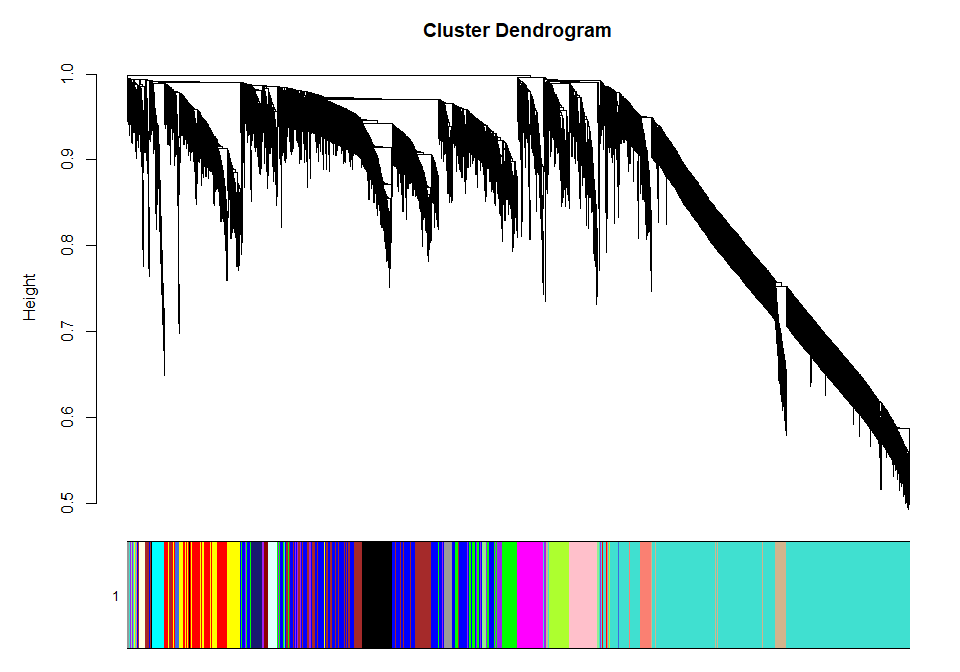
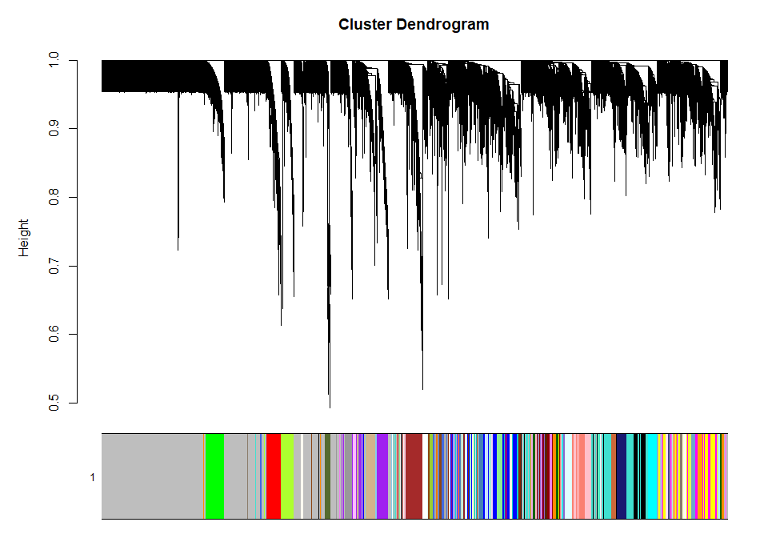
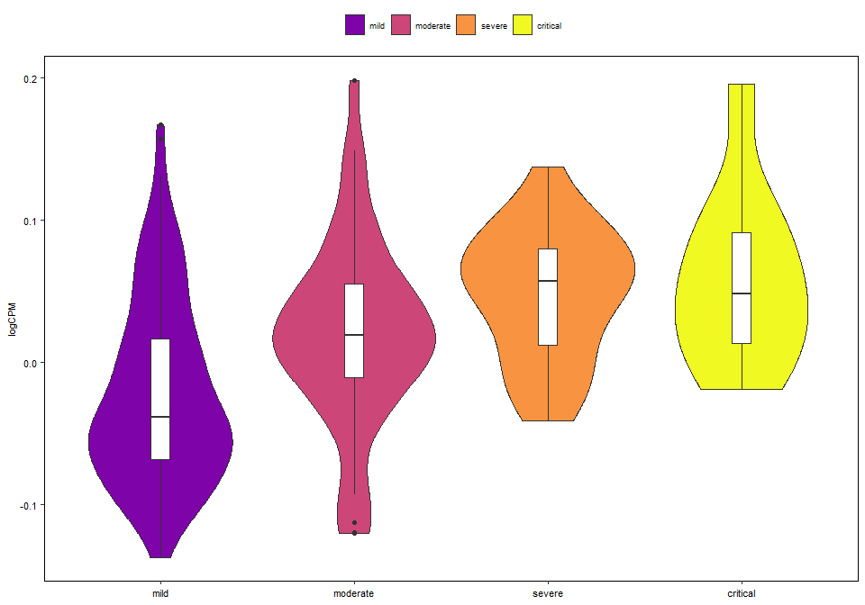

Module Analysis
================
Jack Gisby
2022-04-28

-   [Load data and code](#load-data-and-code)
    -   [Load packages and custom
        functions](#load-packages-and-custom-functions)
    -   [Load normalised datasets](#load-normalised-datasets)
    -   [Calculate correlation
        matrices](#calculate-correlation-matrices)
    -   [Load the rmcorr matrices from CSV
        files](#load-the-rmcorr-matrices-from-csv-files)
-   [Define modules](#define-modules)
-   [Analyse modules](#analyse-modules)
-   [Session info](#session-info)

# Load data and code

## Load packages and custom functions

This chunk loads packages required for the notebook in addition to
custom functions in the `../R` directory. These include functions for
loading data, running differential expression and enrichment analyses
and making plots. The main functions and their arguments are described
by comments within these files.

``` r
# load relevant packages
library(rmcorr)
library(foreach)
library(doParallel)
library(SummarizedExperiment)
library(WGCNA)
library(lmerTest)
library(splines)
library(ggeffects)

# set up plotting settings
library(ggplot2)
library(ggpubr)

theme_set(theme_pubr(border = TRUE))
theme_update(text = element_text(size = 8))

# load custom functions from the R/ directory
source("../R/preprocessing.R")
source("../R/de.R")

set.seed(1)
```

## Load normalised datasets

For the weighted gene correlation network analysis (WGCNA), we loaded
and normalised the transcriptomic and proteomic datasets as we have done
in the previous notebooks (`1_differential_expression.Rmd`,
`2_gsva_analysis.Rmd`). However, we additionally did the following prior
to analysis: - For the RNA-seq data, we normalised both waves
simultaneously rather than separately. - We removed duplicate aptamers
that measured the same protein target. - We removed genes with low
variance (33% of genes with the lowest variance). - We removed samples
from individuals who had been sampled less than three times prior to 21
days following COVID-19 symptom onset.

The normalised data were saved in this repository
(`results/3_supervised_learning/collated_data`) and are loaded in the
chunk below.

``` r
# get the protein data in long format
prot_long <- read.csv("../results/4_module_analysis/collated_data/prot_long.csv")

# convert the long format protein data to a matrix
prot_wide <- tidyr::pivot_wider(dplyr::select(prot_long, sample, value, feature, individual_id), names_from = feature)

# get the normalised RNA-seq data
rna_se <- readRDS("../results/4_module_analysis/collated_data/rna_data.rds")

# convert the long format RNA-seq data to a matrix
rna_long <- reshape2::melt(assay(rna_se, 2))
colnames(rna_long) <- c("feature", "sample", "value")

rna_long$individual_id <- gsub("_.*","", rna_long$sample)
```

## Calculate correlation matrices

WGCNA requires a correlation matrix to be generated as a first step in
the analysis. This is usually achieved using pearson’s correlation,
however, this measure of correlation is not suitable for repeated
measures data. For this reason, we instead generate a correlation matrix
using repeated measures correlation (rmcorr).

The following chunk defines and applies a function to generate
correlation matrices for both the proteomic and transcriptomic datasets.
The rmcorr function must be called repeatedly for each pair of genes or
proteins. This process takes a long time to run but can be run in
parallel.

``` r
# function to calculate a correlation matrix using rmcorr (repeated measures correlation)
calc_cor_matrix <- function(long_data) {
    
    unique_features <- unique(long_data$feature)
    
    # this code turns the long data into an ordered list that is convenient for later calculations
    matrix_data <- long_data[long_data$feature == unique_features[1] ,]
    matrix_data <- dplyr::select(matrix_data, sample, individual_id)
    matrix_data_nrow <- nrow(matrix_data)
    
    # create a sample by feature matrix based on the long dataframe
    for (cname in unique_features) {
        
        if (which(unique_features == cname) %% 1000 == 0) {
            print(which(unique_features == cname))
        }

        feature_values <- long_data[long_data$feature == cname ,]
        feature_values <- dplyr::select(feature_values, -feature)
        colnames(feature_values) <- gsub("value", cname, colnames(feature_values))
        
        stopifnot(nrow(feature_values) == nrow(matrix_data))
        stopifnot(all(feature_values$sample %in% matrix_data$sample))
        stopifnot(!any(duplicated(feature_values$sample)))

        matrix_data <- dplyr::left_join(matrix_data, feature_values, by = c("sample" = "sample", "individual_id" = "individual_id"))
    }
    
    stopifnot(nrow(matrix_data) == matrix_data_nrow)

    # based on https://stackoverflow.com/questions/38318139/run-a-for-loop-in-parallel-in-r
    # setup parallel backend to use many processors
    cores <- detectCores(logical = FALSE)
    print(paste0("Using ", cores, " cores"))
    
    cl <- makeCluster(cores[1]) #not to overload your computer
    registerDoParallel(cl)
    
    # this is like a loop, equivalent to: for (i in 1:length(unique_features)) {
    finalMatrix <- foreach(i = 1:length(unique_features), .combine = cbind) %dopar% {

        # set up a temporary single column matrix to be combined by columns with the final matrix
        tempMatrix <- matrix(nrow = length(unique_features), ncol = 1)
        i_feature <- unique_features[i]
        colnames(tempMatrix) <- i_feature
        rownames(tempMatrix) <- rep("", length(unique_features))

        # compare the selected feature to all the other features
        for (j in 1:length(unique_features)) {

            # if this is a self comparison, correlation is 1
            # only fill in the upper triangle of the matrix - so break once we hit i == j
            if (i == j) {

                tempMatrix[j, 1] <- 1
                break

            } else {

                j_feature <- unique_features[j]

                combined_data <- data.frame(
                    "individual_id" = matrix_data$individual_id,
                    "feature_1" = matrix_data[[i_feature]],
                    "feature_2" = matrix_data[[j_feature]]
                )

                tempMatrix[j, 1] <- rmcorr::rmcorr(
                    individual_id,
                    feature_1,
                    feature_2,
                    combined_data
                )$r
            }
        }
        
        rownames(tempMatrix) <- unique_features

        return(tempMatrix)  # equivalent to finalMatrix <- cbind(finalMatrix, tempMatrix)
    }
    
    stopCluster(cl)
    
    # fill in lower triangle of the matrix
    finalMatrix[lower.tri(finalMatrix)] <- t(finalMatrix)[lower.tri(finalMatrix)]
    stopifnot(isSymmetric(finalMatrix))
    
    return(finalMatrix)
}

datasets <- list(prot = prot_long, rna = rna_long)

# for each data modality
for (dataset_name in names(datasets)) {
    
    print(paste0("--------------------------------------- ", dataset_name))
    
    dataset_rmcorr_matrix <- calc_cor_matrix(datasets[[dataset_name]])
    
    write.csv(dataset_rmcorr_matrix, paste0("../results/4_module_analysis/", dataset_name, "_rmcorr_matrix.csv"))
}
```

## Load the rmcorr matrices from CSV files

``` r
set.seed(1)

rna_rmcorr <- as.matrix(data.table::fread("../results/4_module_analysis/rmcorr_matrices/rna_rmcorr_matrix.csv"), rownames = 1)
prot_rmcorr <- as.matrix(data.table::fread("../results/4_module_analysis/rmcorr_matrices/prot_rmcorr_matrix.csv"), rownames = 1)
```

# Define modules

The next step in the WGCNA workflow is to use the correlation matrix to
define modules of correlated features. WGCNA requires a
soft-thresholding power to be picked. The function
`pickSoftThreshold.fromSimilarity` suggests a soft-thresholding level to
be used based on an R-squared cutoff. Previously, we selected
soft-thresholding powers that maximised R-squared and ensured mean
connectivity was less than 100.

We convert the correlation matrix to a signed topological overlap matrix
and perform clustering. We then use dynamic hybrid clustering to define
modules of correlated features.

``` r
# takes a correlation matrix and returns a list of modules
cmatrix_to_modules <- function(cmatrix, powers = 1:40, deepSplit = 4) {
    
    # based on powers argument, the function will either run a specific power
    # value or a series of values
    if (length(powers) > 1) {
        
        # picks a soft-thresholding power based on the correlation matrix
        threshold <- pickSoftThreshold.fromSimilarity((0.5 * (1 + cmatrix)), RsquaredCut = 0.85, powerVector = powers, verbose = 2)
        power <- threshold$powerEstimate
        
    } else {
        power <- powers
    }
    
    # creates a signed adjacency matrix from the correlation matrix and power value(s)
    adjacency <- adjacency.fromSimilarity(cmatrix, type = "signed", power = power)
    
    # converts to a signed TOM distance matrix
    TOM <- TOMdist(adjacency, TOMType = "signed")
    
    # performs average linkage hierarchical clustering
    clust <- flashClust::flashClust(as.dist(TOM), method = "average")
    
    # cuts the dendrogram using hybrid dynamic clustering
    cutree <- cutreeDynamic(dendro = clust, distM = TOM, method = "hybrid", deepSplit = deepSplit, pamRespectsDendro = FALSE, minClusterSize = 30)
    
    # plots the dendrogram
    modules <- labels2colors(cutree)
    names(modules) <- colnames(adjacency)
    
    plotDendroAndColors(clust, modules, dendroLabels = FALSE)
    
    return(modules)
}

# define the modules
prot_modules <- cmatrix_to_modules(prot_rmcorr, powers = 13, deepSplit = 4)
```

    ## ..connectivity..
    ## ..matrix multiplication (system BLAS)..
    ## ..normalization..
    ## ..done.
    ##  ..cutHeight not given, setting it to 0.995  ===>  99% of the (truncated) height range in dendro.
    ##  ..done.

<!-- -->

``` r
rna_modules <- cmatrix_to_modules(rna_rmcorr, powers = 26, deepSplit = 4)
```

    ## ..connectivity..
    ## ..matrix multiplication (system BLAS)..
    ## ..normalization..
    ## ..done.
    ##  ..cutHeight not given, setting it to 0.999  ===>  99% of the (truncated) height range in dendro.
    ##  ..done.

<!-- -->

``` r
# merge modules based on correlation

reordered_prot_wide <- dplyr::select(prot_wide, sample, individual_id)

for (gene_id in names(prot_modules)) {
    
    col <- data.frame(prot_wide[[gene_id]])
    colnames(col) <- gene_id
    
    reordered_prot_wide <- cbind(reordered_prot_wide, col)
}
```

By default, WGCNA uses colours to denote module names. Instead, we
convert the names to letters before performing further analyses. In the
manuscript, we instead converted the protein module names to numbers.

In this chunk, we also merge highly correlated modules.

``` r
# function converts the default module names (colours) to letters
modules_to_letters <- function(modules) {
    
    # remove unclustered features
    if (any(modules$module == "grey")) {
        unclustered_features <- modules$feature[modules$module == "grey"]
        modules <- modules[!(modules$feature %in% unclustered_features) ,]
    }
    
    # convert to letters
    modules_to_letters <- LETTERS
    modules_to_letters <- modules_to_letters[1:length(unique(modules$module))]
    names(modules_to_letters) <- unique(modules$module)
    modules$module <- sapply(modules$module, function(m) {modules_to_letters[names(modules_to_letters) == m]})
    
    return(modules)
}

# check that the protein modules are in the same order as the prot_wide column names
stopifnot(all(names(prot_modules) == colnames(dplyr::select(reordered_prot_wide, -sample, -individual_id))))

# merge protein modules based on correlation
prot_merged_modules <- mergeCloseModules(dplyr::select(reordered_prot_wide, -sample, -individual_id), prot_modules, cutHeight = 0.25)
```

    ##  mergeCloseModules: Merging modules whose distance is less than 0.25
    ##    Calculating new MEs...

``` r
# converts protein modules to letters and saves them
# note that we denote these using numbers in the manuscript (i.e. A=1, B=2, etc.)
write.csv(
    modules_to_letters(data.frame(feature = names(prot_merged_modules$colors), module = prot_merged_modules$colors)), 
    "../results/4_module_analysis/prot_modules.csv", 
    row.names = FALSE
)

# check that the gene modules are in the same order as the rna_se column names
stopifnot(all(names(rna_modules) == colnames(t(assay(rna_se, 2)))))

# merge gene modules based on correlation
rna_merged_modules <- mergeCloseModules(t(assay(rna_se, 2)), rna_modules, cutHeight = 0.25)
```

    ##  mergeCloseModules: Merging modules whose distance is less than 0.25
    ##    Calculating new MEs...

``` r
write.csv(
    modules_to_letters(data.frame(feature = names(rna_merged_modules$colors), module = rna_merged_modules$colors)), 
    "../results/4_module_analysis/rna_modules.csv", 
    row.names = FALSE
)
```

# Analyse modules

Next, we calculate an eigengene for transcriptomic module B. We scale
and center the normalised expression of module tB before calculating the
eigengene. We then ensure that the direction of the eigengene matches
that of the member genes.

``` r
# get RNA module B (tB)
final_rna_modules <- read.csv("../results/4_module_analysis/prot_modules.csv")
final_rna_modules <- final_rna_modules[final_rna_modules$module == "B" ,]

# set up eigengenes dataframe for module tB
eigengenes <- data.frame(colData(rna_se))

# get ordered contemporaneous severity and grouped clinical course
eigengenes$WHO_temp_severity <- ordered(eigengenes$WHO_temp_severity, c("mild", "moderate", "severe", "critical"))
eigengenes$grouped_WHO_severity <- factor(ifelse(eigengenes$WHO_severity %in% c("mild", "moderate"), "mild_moderate", "severe_critical"), c("mild_moderate", "severe_critical"))

rownames(eigengenes) <- eigengenes$sample_id
eigengenes$WHO_severity <- ordered(eigengenes$WHO_severity, c("mild", "moderate", "severe", "critical"))

# get the wave of the samples
eigengenes$wave <- as.factor(eigengenes$wave - 1)

# scale the normalised expression data
mod_expr <- scale(t(assay(rna_se[which(rowData(rna_se)$gene_id %in% final_rna_modules$feature) ,], 2)))

# calculate the eigengene
eigengenes$expr <- svd(t(mod_expr))$v[,1]

# get the correlation of the member gene's expression with the eigengene
member_cors <- c()
for (i in 1:ncol(mod_expr)) {
    member_cors <- c(member_cors, cor(mod_expr[,i], eigengenes$expr))
}

# make sure the direction of the eigengene is correct
eigengenes$expr <- eigengenes$expr * sign(mean(member_cors))

# remove samples not appropriate for longitudinal modelling
longt_eigengene <- eigengenes[eigengenes$time_from_first_x <= 21 & eigengenes$time_from_first_x >= 0 & !is.na(eigengenes$time_from_first_x) ,]
```

We then attempt to associate the eigengene with contemporaneous
severity, finding that tB has a positive association. This can be seen
in the eigengene boxplots stratified by WHO severity.

``` r
# use linear mixed model to associate contemporaneous severity with the tB eigengene
sev_model <- single_lmer(
    "expr ~ WHO_temp_severity + calc_age + sex + ethnicity + wave + (1 | individual_id)",
    data = eigengenes
)

print(anova(sev_model))
```

    ## Type III Analysis of Variance Table with Satterthwaite's method
    ##                     Sum Sq   Mean Sq NumDF   DenDF F value    Pr(>F)    
    ## WHO_temp_severity 0.032196 0.0107322     3 184.832  8.8941 1.551e-05 ***
    ## calc_age          0.000936 0.0009363     1  38.529  0.7759   0.38386    
    ## sex               0.001543 0.0015433     1  38.889  1.2790   0.26501    
    ## ethnicity         0.005811 0.0019371     3  38.952  1.6053   0.20372    
    ## wave              0.004060 0.0040604     1  38.726  3.3650   0.07429 .  
    ## ---
    ## Signif. codes:  0 '***' 0.001 '**' 0.01 '*' 0.05 '.' 0.1 ' ' 1

``` r
# plot the eigenene expression grouped by contemporaneous severity
ggplot(eigengenes, aes(WHO_temp_severity, expr)) +
    geom_violin(aes(fill = WHO_temp_severity)) +
    scale_fill_manual(values = c("#7E03A8FF", "#CC4678FF", "#F89441FF", "#F0F921FF")) +
    theme(legend.title = element_blank(), axis.title.x = element_blank()) +
    geom_boxplot(width = 0.1) +
    ylab("logCPM")
```

<!-- -->

Finally, we model the longitudinal profile of module tB in an attempt to
ask whether the module has a different profile in severe/critical
vs. mild/moderate disease. The module’s eigengene rises over time in the
severe/critical group, but is relatively flat in milder patients.

``` r
# use linear mixed model to associate the interaction between time and severity with the tB eigengene
longt_model <- single_lmer(
    "expr ~ bs(time_from_first_x, degree = 2) * grouped_WHO_severity + calc_age + sex + ethnicity + wave + (1 | individual_id)",
    data = longt_eigengene
)

print(anova(longt_model))
```

    ## Type III Analysis of Variance Table with Satterthwaite's method
    ##                                                           Sum Sq   Mean Sq
    ## bs(time_from_first_x, degree = 2)                      0.0017655 0.0008828
    ## grouped_WHO_severity                                   0.0007299 0.0007299
    ## calc_age                                               0.0007327 0.0007327
    ## sex                                                    0.0002719 0.0002719
    ## ethnicity                                              0.0065055 0.0021685
    ## wave                                                   0.0023812 0.0023812
    ## bs(time_from_first_x, degree = 2):grouped_WHO_severity 0.0233465 0.0116733
    ##                                                        NumDF   DenDF F value
    ## bs(time_from_first_x, degree = 2)                          2 167.143  0.7641
    ## grouped_WHO_severity                                       1 151.868  0.6318
    ## calc_age                                                   1  38.114  0.6342
    ## sex                                                        1  37.887  0.2354
    ## ethnicity                                                  3  38.406  1.8771
    ## wave                                                       1  38.536  2.0612
    ## bs(time_from_first_x, degree = 2):grouped_WHO_severity     2 167.432 10.1048
    ##                                                           Pr(>F)    
    ## bs(time_from_first_x, degree = 2)                         0.4674    
    ## grouped_WHO_severity                                      0.4279    
    ## calc_age                                                  0.4307    
    ## sex                                                       0.6304    
    ## ethnicity                                                 0.1497    
    ## wave                                                      0.1592    
    ## bs(time_from_first_x, degree = 2):grouped_WHO_severity 7.192e-05 ***
    ## ---
    ## Signif. codes:  0 '***' 0.001 '**' 0.01 '*' 0.05 '.' 0.1 ' ' 1

``` r
ind_table <- table(longt_eigengene$individual_id)

# use ggemmeans to estimate confidence intervals/fits
predictions <- ggemmeans(longt_model, c("time_from_first_x [all]", "grouped_WHO_severity"))
names(predictions) <- c("time_from_first_x", "gene_expr", "std.error", "conf.low", "conf.high", "grouped_WHO_severity")

# plot just the CI estimations
ggplot(predictions, aes(time_from_first_x, gene_expr, group = grouped_WHO_severity, fill = grouped_WHO_severity)) +
    geom_line(aes(colour = grouped_WHO_severity), size = 1.7) +
    geom_ribbon(aes(ymin = conf.low, ymax = conf.high), alpha = 0.055) +
    scale_color_manual(values = c("#2C7BB6", "#D7191C")) +
    scale_fill_manual(values = c("#2C7BB6", "#D7191C"))
```

<!-- -->

# Session info

Session information collected at the point this markdown document was
knit.

``` r
sessionInfo()
```

    ## R version 4.1.2 (2021-11-01)
    ## Platform: x86_64-w64-mingw32/x64 (64-bit)
    ## Running under: Windows 10 x64 (build 19044)
    ## 
    ## Matrix products: default
    ## 
    ## locale:
    ## [1] LC_COLLATE=English_United Kingdom.1252 
    ## [2] LC_CTYPE=English_United Kingdom.1252   
    ## [3] LC_MONETARY=English_United Kingdom.1252
    ## [4] LC_NUMERIC=C                           
    ## [5] LC_TIME=English_United Kingdom.1252    
    ## 
    ## attached base packages:
    ##  [1] splines   stats4    parallel  stats     graphics  grDevices utils    
    ##  [8] datasets  methods   base     
    ## 
    ## other attached packages:
    ##  [1] ggpubr_0.4.0                ggplot2_3.3.5              
    ##  [3] ggeffects_1.1.1             lmerTest_3.1-3             
    ##  [5] lme4_1.1-28                 Matrix_1.3-4               
    ##  [7] WGCNA_1.70-3                fastcluster_1.2.3          
    ##  [9] dynamicTreeCut_1.63-1       SummarizedExperiment_1.24.0
    ## [11] Biobase_2.54.0              GenomicRanges_1.46.1       
    ## [13] GenomeInfoDb_1.30.1         IRanges_2.28.0             
    ## [15] S4Vectors_0.32.3            BiocGenerics_0.40.0        
    ## [17] MatrixGenerics_1.6.0        matrixStats_0.61.0         
    ## [19] doParallel_1.0.17           iterators_1.0.14           
    ## [21] foreach_1.5.2               rmcorr_0.4.5               
    ## 
    ## loaded via a namespace (and not attached):
    ##   [1] minqa_1.2.4            colorspace_2.0-2       ggsignif_0.6.3        
    ##   [4] ellipsis_0.3.2         sjlabelled_1.1.8       estimability_1.3      
    ##   [7] htmlTable_2.4.0        XVector_0.34.0         base64enc_0.1-3       
    ##  [10] rstudioapi_0.13        farver_2.1.0           bit64_4.0.5           
    ##  [13] mvtnorm_1.1-3          AnnotationDbi_1.56.2   fansi_1.0.2           
    ##  [16] codetools_0.2-18       cachem_1.0.6           impute_1.68.0         
    ##  [19] knitr_1.37             Formula_1.2-4          nloptr_2.0.0          
    ##  [22] broom_0.7.12           cluster_2.1.2          GO.db_3.14.0          
    ##  [25] png_0.1-7              compiler_4.1.2         httr_1.4.2            
    ##  [28] emmeans_1.7.2          backports_1.4.1        assertthat_0.2.1      
    ##  [31] fastmap_1.1.0          cli_3.1.1              htmltools_0.5.2       
    ##  [34] tools_4.1.2            gtable_0.3.0           glue_1.6.1            
    ##  [37] GenomeInfoDbData_1.2.7 reshape2_1.4.4         dplyr_1.0.8           
    ##  [40] Rcpp_1.0.8             carData_3.0-5          vctrs_0.3.8           
    ##  [43] Biostrings_2.62.0      preprocessCore_1.56.0  nlme_3.1-153          
    ##  [46] insight_0.16.0         xfun_0.29              stringr_1.4.0         
    ##  [49] lifecycle_1.0.1        rstatix_0.7.0          zlibbioc_1.40.0       
    ##  [52] MASS_7.3-54            scales_1.1.1           RColorBrewer_1.1-2    
    ##  [55] yaml_2.2.2             memoise_2.0.1          gridExtra_2.3         
    ##  [58] rpart_4.1-15           latticeExtra_0.6-29    stringi_1.7.6         
    ##  [61] RSQLite_2.2.10         highr_0.9              checkmate_2.0.0       
    ##  [64] boot_1.3-28            rlang_1.0.1            pkgconfig_2.0.3       
    ##  [67] bitops_1.0-7           evaluate_0.15          lattice_0.20-45       
    ##  [70] purrr_0.3.4            labeling_0.4.2         htmlwidgets_1.5.4     
    ##  [73] bit_4.0.4              tidyselect_1.1.1       plyr_1.8.6            
    ##  [76] magrittr_2.0.2         R6_2.5.1               generics_0.1.2        
    ##  [79] Hmisc_4.6-0            DelayedArray_0.20.0    DBI_1.1.2             
    ##  [82] pillar_1.7.0           foreign_0.8-81         withr_2.4.3           
    ##  [85] survival_3.2-13        KEGGREST_1.34.0        abind_1.4-5           
    ##  [88] RCurl_1.98-1.6         nnet_7.3-16            tibble_3.1.6          
    ##  [91] crayon_1.5.0           car_3.0-12             utf8_1.2.2            
    ##  [94] rmarkdown_2.11         jpeg_0.1-9             grid_4.1.2            
    ##  [97] data.table_1.14.2      blob_1.2.2             flashClust_1.01-2     
    ## [100] digest_0.6.29          xtable_1.8-4           tidyr_1.2.0           
    ## [103] numDeriv_2016.8-1.1    munsell_0.5.0
